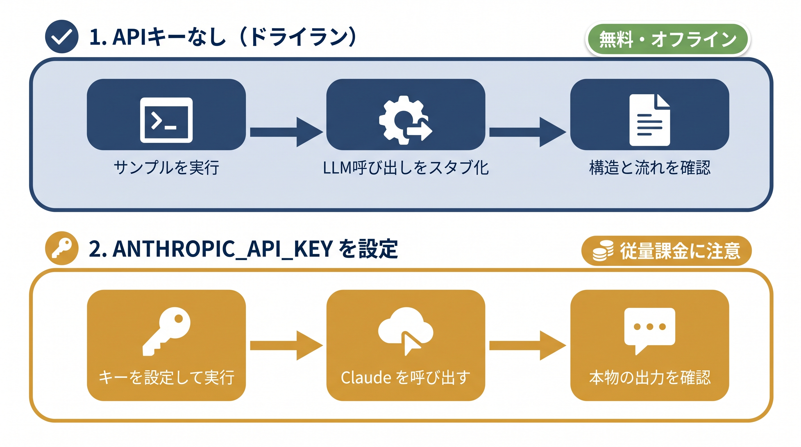

# 『AIエージェント導入を任されたら読む本』サンプルコード

本リポジトリは、書籍『AIエージェント導入を任されたら読む本』（日経BP、2026年）に掲載されたサンプルコードの公式リポジトリです。書籍を読みながら、掲載コードを実際に動かして確かめられます。

## 収録章

| フォルダ | 章 | 主な内容 | APIキーなしで確認 |
|---|---|---|---|
| `chapters/03_ベクターDBとRAG` | 第3章 | Chroma によるベクター検索と RAG | ○（生成のみ要キー） |
| `chapters/04_ツール連携とFunction Calling` | 第4章 | Function Calling の最小実装 | ○（ドライラン） |
| `chapters/05_MCPと標準化` | 第5章 | MCP Inspector で公式サーバーに触れる | ○（要 Node.js） |
| `chapters/06_エージェントを裸で書く` | 第6章 | Dify ハンズオン／エージェントループの素書き | ○（ドライラン） |
| `chapters/07_LangGraphの最小セット` | 第7章 | StateGraph・ReAct・checkpoint・interrupt | ○ |
| `chapters/08_自作MCPサーバーを書く` | 第8章 | FastMCP による自作 MCP サーバー | ○ |
| `chapters/11_社内ナレッジ横断AIエージェント` | 第11章 | 権限制御つきナレッジ横断（ケーススタディ） | ○（擬似モデル） |
| `chapters/12_営業商談準備AIエージェント` | 第12章 | Planner-Executor と HITL（ケーススタディ） | ○（擬似モデル） |
| `chapters/13_文書レビュー補助AIエージェント` | 第13章 | 並列レビューと根拠照合（ケーススタディ） | ○（擬似モデル） |
| `chapters/14_評価と観測性` | 第14章 | データセット評価・LLM-as-a-Judge・トレース | ○（promptfoo のみ要キー） |
| `chapters/15_ガードレールとガバナンス` | 第15章 | 入出力フィルタ・PII マスキング・監査ログ | ○ |
| `chapters/16_コスト設計とSLA` | 第16章（コスト設計とサービス品質） | トークンコスト試算・キャッシュ・スロットリング | ○ |
| `chapters/17_知識ベース運用とETL` | 第17章 | 再埋め込みコストの試算 | ○ |

第1・2・9・10章は実行コードを伴わないため、本リポジトリには含まれません。

## 動作環境

- Python 3.10 以上（3.12 で動作確認）
- [uv](https://docs.astral.sh/uv/) を推奨（`python -m venv` + `pip` でも可。各章 README に両方の手順があります）
- 第5章と、第8章・第14章の一部で Node.js（`npx`）を使います

依存パッケージは章ごとに異なるため、**章ごとに独立した仮想環境**を作ってください。

```bash
cd "chapters/07_LangGraphの最小セット/samples"
uv venv --python 3.12
uv pip install -r requirements.txt
.venv/bin/python 7-3_minimal_graph.py
```

標準ライブラリのみで動く章（14〜17章、および 4・6 章のドライラン）は、依存インストールなしでそのまま実行できます。

## 2つの動かし方



各章のサンプルは、次の2段階で確かめられるように作られています。

1. **APIキーなし（ドライラン）** — LLM 呼び出しをスタブ化するなどして、コードの構造と処理の流れをオフラインで確認できます。まずはこちらで全体を掴んでください。
2. **ANTHROPIC_API_KEY を設定して実行** — 実際に Claude を呼び出して動かします。[Anthropic Console](https://console.anthropic.com/) で API キーを取得し、`export ANTHROPIC_API_KEY=...` を設定してください。

API キーを使う場合の共通の注意:

- **従量課金が発生します。** 各章 README に消費規模の目安を記載しています。
- 入力したテキストやサンプル文書は Anthropic の API に送信されます。**実際の社内文書や機密情報は入力しないでください。**
- コード中のモデル名（`claude-sonnet-4-6` 等）は将来廃止されることがあります。エラーになった場合の書き換え箇所は各章 README を参照してください。
- LLM の出力は実行のたびに変わります。書籍や README の出力例と一言一句は一致しません。

## 自分の入力で確かめる

書籍掲載コードに加えて、自分の質問や条件を入力して試せる本リポジトリ限定のスクリプト（`interactive_*.py` / `try_*.py`）を各章に用意しています。書籍本文には登場しない追加教材です。使い方は各章 README の「自分で確かめる」を参照してください。

## 確認の進め方

各章の `samples/README.md` に、その章の収録ファイル・セットアップ・実行手順・期待出力・注意点がまとまっています。**まず章の README を読んでから実行してください。**

第6章の Dify ハンズオンは、クラウド版 Dify で確かめる手順を [`chapters/06_エージェントを裸で書く/samples/6-1_dify_cloud_handson.md`](chapters/06_エージェントを裸で書く/samples/6-1_dify_cloud_handson.md) にまとめています。

## 補足

- 本リポジトリのコードは学習用のサンプルです。そのまま本番環境で使うことは想定していません。
- 外部サービス（Anthropic API、Dify、promptfoo 等）の画面や仕様は変わることがあります。記載は執筆時点のものです。
