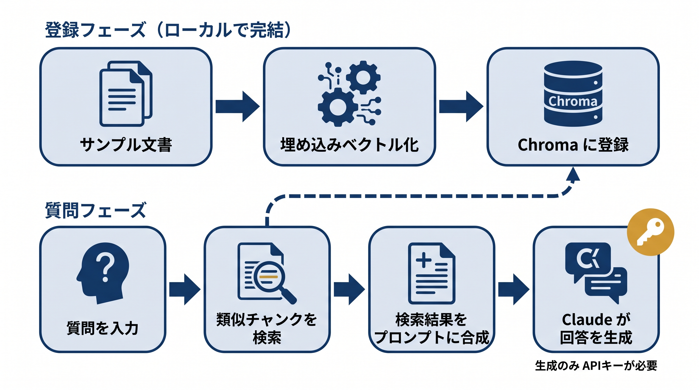

# 第3章 ベクターDBとRAG — サンプルコード

本書 第3章の掲載コードを、手元でそのまま動かせる形にまとめたものです。
社内規程を模した3つの文書をベクターDB（Chroma）に取り込み、日本語の質問で意味検索できること、さらに検索結果をプロンプトに差し込んで LLM に渡す「生成」までの流れを確かめられます。



## 収録ファイル

| ファイル | 対応する本文の節 | 確かめられること | APIキー |
|---------|----------------|----------------|--------|
| `3-3_rag_minimal.py` | 3-3「手を動かす：Chromaで最小のRAGを組む」 | 取り込み→検索。日本語の質問で意味の近い文書が取り出せること | 不要 |
| `3-4_rag_with_generation.py` | 3-4「チャンク分割と検索結果の渡し方」（後半の生成部分） | 検索結果を「参考文書」欄に差し込んだプロンプトの組み立て。キーがあれば Claude での回答生成まで | 任意 |
| `interactive_rag.py` | （本リポジトリ限定の追加教材。本文には登場しません） | 自分で考えた質問での検索・生成の試行 | 検索のみなら不要 |

## 前提

- Python 3.10 以上（3.10〜3.12 で動作確認）
- パッケージ管理は [uv](https://docs.astral.sh/uv/) を推奨します。uv がない場合は標準の `venv` + `pip` でも同じ手順で動きます
- 動作確認バージョン: chromadb 1.5.x / sentence-transformers 5.x（`requirements.txt` に記載）

## セットアップ

uv を使う場合:

```bash
cd chapters/03_ベクターDBとRAG/samples
uv venv
source .venv/bin/activate        # Windows は .venv\Scripts\activate sourceは不要です。
uv pip install -r requirements.txt
```

uv がない場合（標準の venv + pip）:

```bash
cd chapters/03_ベクターDBとRAG/samples
python3 -m venv .venv
source .venv/bin/activate        # Windows は .venv\Scripts\activate
pip install -r requirements.txt
```

## APIキーなしで確認する（ドライラン）

このサンプルの埋め込み（ベクトル化）はローカルモデル（sentence-transformers）で行うため、検索まではAPIキーなしで動きます。

> **初回はモデルのダウンロードが走ります**
>
> 初回実行時に日本語対応の埋め込みモデル `paraphrase-multilingual-MiniLM-L12-v2`（約 0.5GB）を自動ダウンロードするため、ネットワーク接続と数分の待ち時間が必要です。2回目以降は `~/.cache/huggingface/` のキャッシュから読み込むため、すぐに始まります。

```bash
# 3-3: 取り込み→検索
python 3-3_rag_minimal.py
```

期待される出力（要点）: 3つの質問それぞれに対し、意味の近い文書が1件ずつ返ります。

```text
Q: 休みを取りたいときの手続きは？
 -> 年次有給休暇は入社半年後に10日付与され、勤怠システムから前日までに申請します。
Q: 立て替えたお金はどう請求する？
 -> 出張旅費や立替経費は、月末締めで翌月10日までに領収書を添付して経費システムへ申請します。
Q: 機密情報の保管ルールは？
 -> 社外秘データは指定の暗号化ストレージに保管し、パスワードは90日ごとに変更してください。
```

キーワードが一致していなくても（「休み」→「有給休暇」）意味で対応する文書が取り出せている点が、本文 3-2〜3-3 で説明した埋め込みベクトルによる意味検索の効果です。

```bash
# 3-4: 検索→プロンプト組み立て（キーなしの場合はここまで）
python 3-4_rag_with_generation.py
```

期待される出力（要点）: 検索で取り出した上位2件のチャンクを「# 参考文書」欄に差し込んだプロンプトが表示され、最後に「ANTHROPIC_API_KEY 未設定のため、生成は行わずプロンプト表示のみ」というメモが出て終了します。本文 3-4 節に掲載したプロンプトの形が、実際の検索結果で組み上がる様子を確認できます。

## ANTHROPIC_API_KEY を使って動かす（生成まで）

3-4 の「生成」まで試す場合は、`anthropic` パッケージと Anthropic の API キーが必要です。

```bash
pip install anthropic                    # uv でセットアップした場合は: uv pip install anthropic
export ANTHROPIC_API_KEY=sk-ant-...      # Windows (cmd) は set ANTHROPIC_API_KEY=... powershellの場合$env:ANTHROPIC_API_KEY=...
python 3-4_rag_with_generation.py
```

> uv の `uv venv` で作った仮想環境には `pip` コマンドが入っていません。uv でセットアップした場合は `pip install ...` の代わりに `uv pip install ...` を使ってください。

プロンプト表示に続けて「=== Claude の回答 ===」として、参考文書に基づいた回答が表示されます。

実行前に知っておくべきこと:

- **従量課金が発生します。** 1回の実行で送受信するのは入出力あわせて 1,000 トークン前後（入力は数百トークン、出力は最大512トークンに制限）です。少額ですが無料ではありません
- **モデル名は将来変わります。** コード中のモデル名（`3-4_rag_with_generation.py` の `generate_with_claude` 内、および `interactive_rag.py` 冒頭の `MODEL`）が廃止された場合は、Anthropic 公式ドキュメントで現行のモデル名を確認して書き換えてください
- **データが Anthropic の API に送信されます。** サンプルの社内規程風の文書と質問文がプロンプトとして送られます（架空の内容なので問題ありませんが、自分の文書を差し替える場合は送信してよい内容か確認してください）
- **出力は実行ごとに変わりえます。** LLM の回答は毎回同一ではありません。「参考文書の内容に基づいて答えているか」を確認の観点にしてください

## 自分で確かめる（interactive_rag.py）

`interactive_rag.py` は、自分で考えた質問で検索・生成を試すための本リポジトリ限定の追加スクリプトです（書籍本文には登場しません）。検索のみならAPIキー不要で、`--generate` を付けたときだけ Anthropic API で回答を生成します。

```bash
# 対話モード（検索のみ・キー不要）。空行または Ctrl+C で終了
python interactive_rag.py

# 質問を1回だけ実行
python interactive_rag.py --question "パスワードは何日ごとに変えればいい？"

# 生成まで行う（要 ANTHROPIC_API_KEY と pip install anthropic）
python interactive_rag.py --generate

# 検索件数を変える（既定は2件）
python interactive_rag.py --n-results 3
```

試すとよい入力例:

- `パスワードは何日ごとに変えればいい？` — 「機密情報」という語を使わなくても doc3 が上位に来るか
- `出張のお金って戻ってくる？` — 口語的な聞き方でも経費の文書（doc2）に届くか
- `ランチのおすすめは？` — 登録文書と無関係な質問。検索は「一番マシな候補」を返してしまうこと、生成モードでは「資料からは分かりません」と答えられるかを観察できます

各ヒットには距離（distance）が表示されます。値が小さいほど質問と意味が近いことを表し、無関係な質問では距離が大きくなることも確認できます。

## うまくいかないとき

- **依存のインストールに失敗する**: Python のバージョンを確認してください（3.10〜3.12 を推奨。`python3 --version`）。sentence-transformers は PyTorch を含むため、ダウンロード容量が大きく時間がかかることがあります。ディスク空き容量（数GB）も確認してください
- **初回実行が長い・途中で止まる**: 埋め込みモデル（約 0.5GB）のダウンロード中です。ネットワーク接続を確認し、そのまま待ってください
- **`ModuleNotFoundError: No module named 'chromadb'`**: 仮想環境が有効化されていません。`source .venv/bin/activate` を実行してから再試行してください
- **生成モードで「ANTHROPIC_API_KEY 未設定」と出る**: `export ANTHROPIC_API_KEY=sk-ant-...` を実行したシェルと同じシェルでスクリプトを実行しているか確認してください
- **`not_found_error` などモデル名に関するAPIエラー**: モデルが廃止された可能性があります。上記「モデル名は将来変わります」の要領でコード中のモデル名を現行のものに書き換えてください
- **回答の内容が期待と違う**: LLM の出力は毎回変わります。まず検索結果（参考文書に正しいチャンクが入っているか）を確認し、検索が正しければプロンプト側、検索が外れていれば取り込み・検索側を疑う——という本文 3-4 の切り分けを実践してみてください
