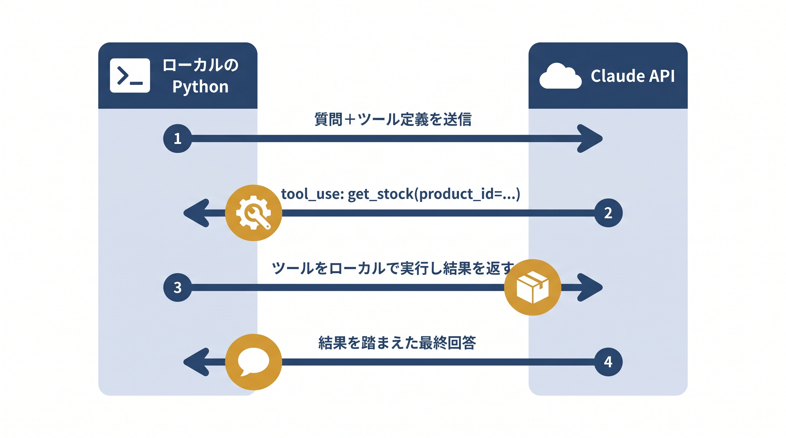

# 第4章 ツール連携とFunction Calling — サンプルコード

本書 第4章の掲載コードを、手元でそのまま動かせる形にまとめたものです。
1つのツール（架空の在庫照会 `get_stock`）をモデルに渡し、「モデルは要求を出すだけ・実行はアプリ側」という Function Calling の分業と、`tools` → `tool_use` → `tool_result` の往復の型を確かめられます。



## 収録ファイル

| ファイル | 対応する本文の節 | 確かめられること | APIキー |
| --------- | ---------------- | ---------------- | -------- |
| `4-2_function_calling_minimal.py` | 4-2「AnthropicSDKでFunction Callingを直接書く」/ 4-3「ツール定義とJSON Schema」 | tool_use → tool_result の一往復。キーなしでも往復の構造を表示するドライラン付き | 任意 |
| `interactive_function_calling.py` | （本リポジトリ限定の追加教材。本文には登場しません） | 自分の質問でどのツールがどの引数で呼ばれるか（発火の有無・引数の埋まり方）の観察 | 観察には必要 |

## 前提

- Python 3.10 以上（3.10〜3.12 で動作確認）
- パッケージ管理は [uv](https://docs.astral.sh/uv/) を推奨します。uv がない場合は標準の `venv` + `pip` でも同じ手順で動きます
- 依存パッケージは `anthropic`（0.40 以上）のみで、必要になるのは実際にAPIを呼ぶときだけです。ドライランは追加インストールなしの素の Python で動きます

## セットアップ

ドライランだけならセットアップ不要です。APIキーで動かす場合のみ以下を実行します。

uv を使う場合:

```bash
cd chapters/04_ツール連携とFunction Calling/samples
uv venv
source .venv/bin/activate        # Windows は .venv\Scripts\activate
uv pip install -r requirements.txt
```

uv がない場合（標準の venv + pip）:

```bash
cd chapters/04_ツール連携とFunction Calling/samples
python3 -m venv .venv
source .venv/bin/activate        # Windows は .venv\Scripts\activate
pip install -r requirements.txt
```

## APIキーなしで確認する（ドライラン）

APIキーが未設定のときは、実際のAPIは呼ばず、Function Calling の一往復の構造（①〜⑤）とダミー実行の流れを表示します。

```bash
python 4-2_function_calling_minimal.py
```

期待される出力（要点）:

```text
[メモ] ANTHROPIC_API_KEY 未設定のため、API は呼ばずに流れだけを表示します。
質問: 商品A-100の在庫はいくつ？

① アプリ → モデル：tools とユーザーの質問を送る
   tools = ['get_stock']

② モデル → アプリ：tool_use を返す（実際にはモデルが判断する部分）
   stop_reason = 'tool_use'
   tool_use = {'name': 'get_stock', 'input': {'product_code': 'A-100'}}

③ アプリ：ツールを実行する
   get_stock(product_code='A-100') -> '42'

④ アプリ → モデル：tool_result を返す（tool_use_id で対応づけ）
   tool_result.content = '42'

⑤ モデル：結果を踏まえて最終回答（例：『商品A-100の在庫は42個です』）
```

本文 4-2 節で説明した「定義と実装は別物」「モデルは要求を出すだけで、実行するのはアプリ」という分業を、APIなしで追えます。

## ANTHROPIC_API_KEY を使って動かす（本番モード）

キーを設定すると、実際に Claude が `get_stock` を使うかどうかを判断し、tool_use → tool_result の往復を経て最終回答まで進みます。

```bash
export ANTHROPIC_API_KEY=sk-ant-...      # Windows (cmd) は set ANTHROPIC_API_KEY=... Windows（powershell）は $env:ANTHROPIC_API_KEY="..."
python 4-2_function_calling_minimal.py
```

`[stop_reason] tool_use` → `[tool_use] get_stock({'product_code': 'A-100'})` → `[stop_reason] end_turn` → 最終回答（例「商品A-100の在庫は42個です」）の順に表示されます。

実行前に知っておくべきこと:

- **従量課金が発生します。** 1つの質問につきAPIを2回以上呼ぶ（ツール要求→結果を返して再問い合わせ）ため、1回の実行で入出力あわせて数百〜2,000トークン程度を消費します。少額ですが無料ではありません
- **モデル名は将来変わります。** `4-2_function_calling_minimal.py` 冒頭の定数 `MODEL`（例 `claude-sonnet-4-6`）が廃止された場合は、Anthropic 公式ドキュメントで現行のモデル名を確認して書き換えてください（`interactive_function_calling.py` もこの定数を参照します）。tools / tool_use / tool_result のやり取りの「型」はモデルが新しくなっても変わりません
- **質問文とツール定義が Anthropic の API に送信されます。** サンプルは架空の在庫データなので問題ありませんが、質問を自由入力する際は送信してよい内容か確認してください
- **出力は実行ごとに変わりえます。** ツールを使うかどうか・最終回答の文面はモデルの判断であり、毎回同一ではありません。「どのツールがどの引数で呼ばれたか」を確認の観点にしてください

## 自分で確かめる（interactive_function_calling.py）

`interactive_function_calling.py` は、自分の質問で「どのツールがどの引数で呼ばれるか」を観察するための本リポジトリ限定の追加スクリプトです（書籍本文には登場しません）。モデルの判断を観察するにはAPIキーが必要で、未設定のときは起動時にその旨を案内したうえで、①（アプリ→モデルに何が送られるか）だけを表示する構造確認モードで動きます。

```bash
# 対話モード。空行または Ctrl+C で終了
python interactive_function_calling.py

# 質問を1回だけ実行
python interactive_function_calling.py --question "商品B-200の在庫はある？"
```

試すとよい入力例:

- `商品A-100の在庫はいくつ？` — ツールが発火し、`product_code='A-100'` が引数に埋まる基本形
- `A-100とB-200、在庫が多いのはどっち？` — 複数の tool_use（または複数往復）が起きるか。B-200 は在庫0です
- `おすすめの商品はどれ？` — 在庫照会では答えられない質問。ツールを使わずに（stop_reason が `end_turn` のまま）答えるか、それでも発火してしまうかを観察できます

在庫データは `A-100`: 42個、`B-200`: 0個、それ以外のコードは0を返すダミー実装です。存在しない商品コード（`C-300` など）を尋ねたときにモデルが「在庫0」と「商品が存在しない」をどう区別するか（できないか）も、本文 4-3 のツール定義の書き方を考える良い材料になります。

## うまくいかないとき

- **`ModuleNotFoundError: No module named 'anthropic'`（キー設定済みなのにドライランになる／エラーになる）**: 仮想環境の有効化（`source .venv/bin/activate`）と `pip install -r requirements.txt` を確認してください
- **キーを設定したのにドライランのままになる**: `export ANTHROPIC_API_KEY=...` を実行したシェルと同じシェルでスクリプトを実行しているか確認してください（`echo $ANTHROPIC_API_KEY` で表示されるか）
- **`authentication_error`**: APIキーの値が正しいか、有効なキーかを Anthropic Console で確認してください
- **`not_found_error` などモデル名に関するAPIエラー**: モデルが廃止された可能性があります。`4-2_function_calling_minimal.py` の `MODEL` を現行のモデル名に書き換えてください
- **ツールが発火しない／期待と違う引数になる**: 異常ではありません。使うかどうかはモデルが `description` を読んで判断します。質問の言い回しを変えて発火の変化を観察するのも、このサンプルの使い方の1つです
