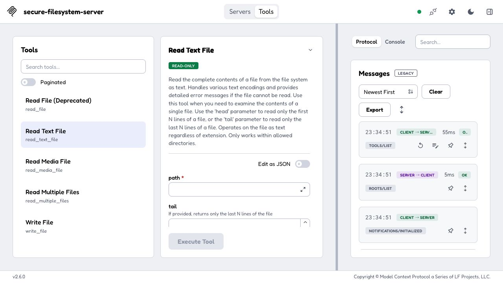
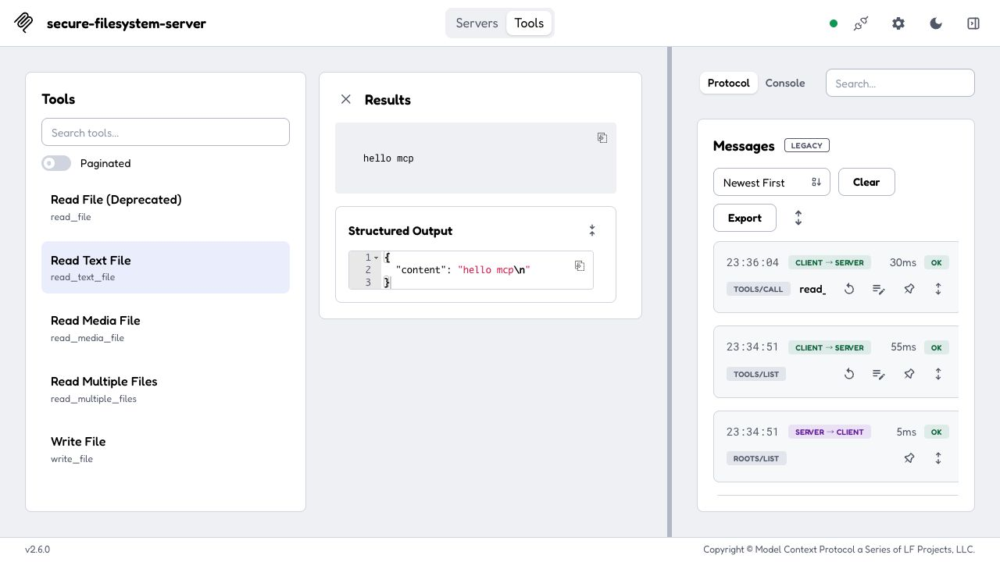

# 5-3 ハンズオン：MCP Inspector で既存サーバーをのぞく

本書 第5章 5-3節「既存のMCPサーバーを使ってみる」のハンズオン手順です。本文では「公開済みのMCPサーバーに確認用ツールでつなぎ、`tools/list`／`tools/call` を目で見る」流れを追いました。ここでは、実際に動かすための環境構築・起動コマンド・AIアプリ（ホスト）への登録手順をまとめます。

この手順で確かめられるのは次の2点です。**APIキーは不要**で、数分で試せます。

- 自分ではコードを1行も書いていないのに、公開済みサーバーのツール群（ファイル読み取り・一覧・検索など）が `tools/list` の結果として一覧に現れること
- そのツールを画面から実行（`tools/call`）すると、結果が標準の形で返ってくること

> **バージョンについての注意**
> コマンド・パッケージ名・既定ポート・設定例は、執筆時点のMCP公式ドキュメント（modelcontextprotocol.io）に基づきます。変わっている場合は公式の最新手順を確認してください。

## 使うもの

| 名前 | 役割 | 出典 |
| :-- | :-- | :-- |
| MCP Inspector | MCPサーバーの公開要素（ツール／リソース／プロンプト）を一覧・実行できる公式の確認ツール | modelcontextprotocol.io/docs/tools/inspector |
| `@modelcontextprotocol/server-filesystem` | 指定フォルダ内のファイルを読み書きするツールを公開する公式の参照サーバー | modelcontextprotocol.io/docs/develop/connect-local-servers |

どちらも `npx` 実行時に取得されるため、事前インストールは基本不要です。

検証対象を Inspector **2.6.0** / filesystem server **2026.8.31** に固定しています。[公式手順](https://modelcontextprotocol.io/docs/tools/inspector)のNode.js要件は22.19.0以上です。

## 前提：Node.js

`npx` コマンドを使うためNode.jsが必要です。未導入なら [Node.js公式サイト](https://nodejs.org/) から**LTS版**を入れてください。導入確認は次のとおりです。

```bash
node -v   # v22.19.0 以上の表示が出ればOK
npx -v
```

Pythonは使いません。APIキーも不要です。

## 起動する

末尾のパスが「サーバーにアクセスを許すフォルダ」です。**練習用の空フォルダ**を指定します（業務データの入った場所は渡さないでください）。

```bash
# 練習用フォルダを用意（中にテキストを1〜2個置いておくと確認しやすい）
mkdir -p ~/mcp-test
echo "hello mcp" > ~/mcp-test/sample.txt

# Inspector を起動し、filesystem サーバーを接続先として渡す
npx -y @modelcontextprotocol/inspector@2.6.0 npx -y @modelcontextprotocol/server-filesystem@2026.8.31 ~/mcp-test
```

起動時に表示されたURLをブラウザで開きます。URLにセッショントークンが含まれる場合は、そのまま開き、共有する画像には含めないでください。サーバー横の接続スイッチをオンにし、Connectedになったら上部の **Tools** を開きます。

## 見るべきポイント

1. サーバーに接続すると、`tools/list` の結果として**ツール一覧**（ファイル読み取り・一覧・検索・書き込み・編集・移動など）が表示されます。それぞれに、第4章で見たのと同じ名前・説明・入力スキーマ（引数の形）が付いていることを確認してください
2. **Read Text File（read_text_file）** を選び、引数に `sample.txt` の絶対パス（例：`/Users/yourname/mcp-test/sample.txt`）を入れて実行すると（これが `tools/call`）、`hello mcp` という中身が結果として返ります
3. ここまでで、ファイルシステムサーバーのコードを**1行も書いていない**ことに注目してください。公開済みのサーバーに共通のプロトコルでつないだだけで、その機能をそのまま使えました。これが本文5-1〜5-2の「標準化のうまみ」の実体です

## うまくいかないとき

| 症状 | 対処 |
|------|------|
| ブラウザ画面が開かない・ポート競合 | ターミナルのエラーと表示URLを確認してください。起動中の別のInspectorとポートが重複していないか確認します |
| `tools/call` がパスのエラーになる | 対象にできるのは、起動時に許可したフォルダ（ここでは `~/mcp-test`）の中だけです。フルパスで指定すると確実です |
| `npx` が見つからない | Node.jsのインストールと、ターミナルの開き直しを確認してください |
| 画面の構成が本手順と違う | Inspectorは更新されます。冒頭の注意のとおり、公式ドキュメントで現行の手順を確認してください |

## 発展：Claude Desktop（実際のホスト）から使う

同じfilesystemサーバーは、確認用のInspectorではなく実際のAIアプリ（ホスト）からも使えます。Claude Desktopの場合、設定ファイル `claude_desktop_config.json` の `mcpServers` に登録します。

```json
{
  "mcpServers": {
    "filesystem": {
      "command": "npx",
      "args": ["-y", "@modelcontextprotocol/server-filesystem", "/絶対パス/mcp-test"]
    }
  }
}
```

登録後にClaude Desktopを再起動すると、チャットから「そのフォルダを整理して」のように依頼でき、ファイルを書き換える操作の前にはユーザーの**承認**を求める作りで動きます（第4章「取り消せない操作の前に人間が確認する」がホスト側に組み込まれている例です）。設定ファイルの場所など最新手順はMCP公式の "Connect to local MCP servers" を参照してください。

## 安全上の注意（重要）

filesystemサーバーは、許可フォルダ内を**あなたのユーザー権限で**読み書きします。つまり、あなたが手でできるファイル操作は何でも実行され得ます。許可は練習用の空フォルダだけにとどめ、ホームフォルダ全体や業務データの場所を丸ごと渡さないでください。「MCPサーバーに何を任せると、どこまでの権限を渡すことになるか」を体感する題材でもあります（権限設計の詳細は第15章）。

## 検証時の画面（2026-09-14）

Node.js 22.21.1 / Inspector 2.6.0 / filesystem server 2026.8.31。練習用ファイルのみを使い、ツール一覧の取得と `read_text_file` の実行を確認しました。




