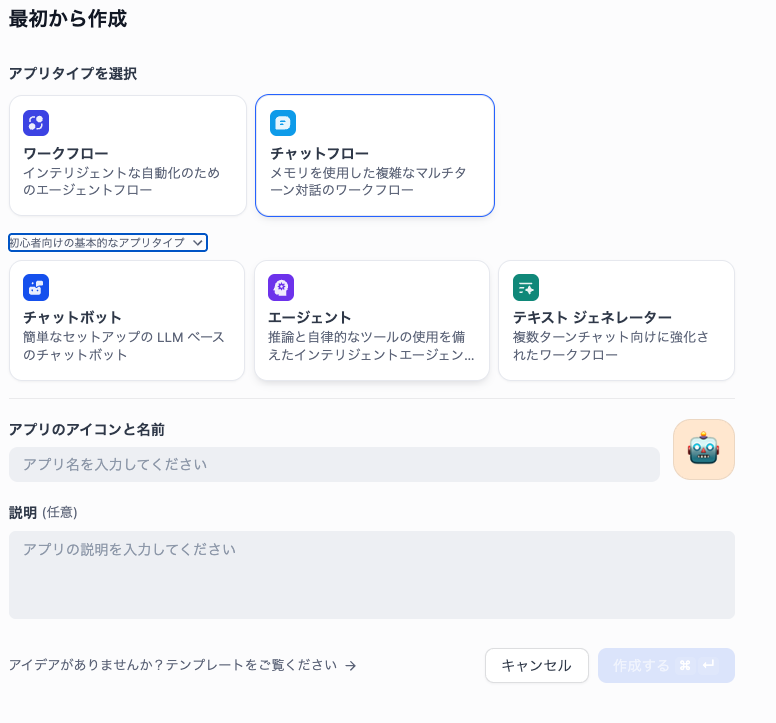
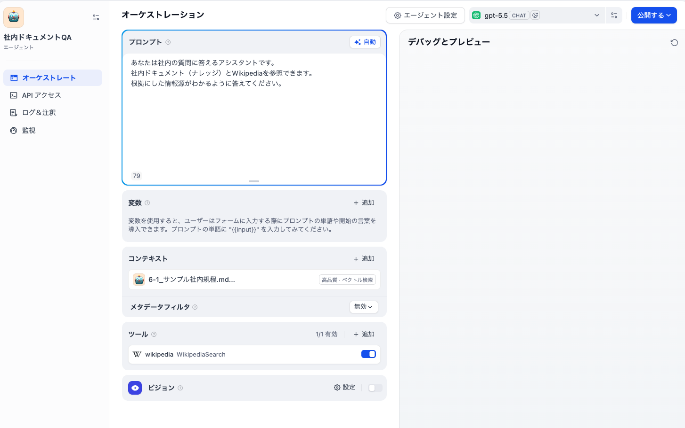
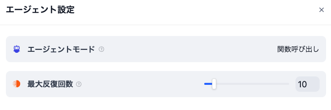
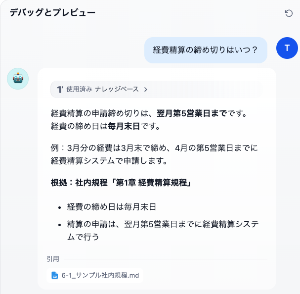
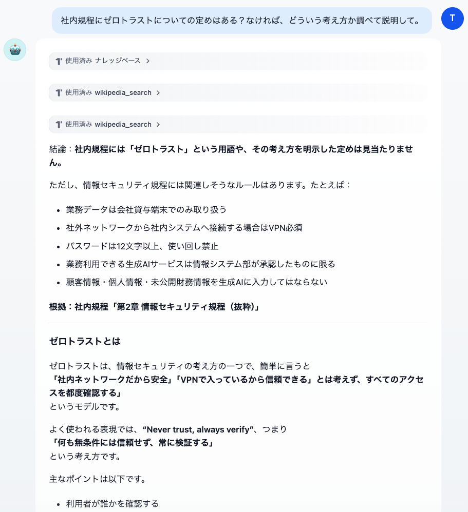
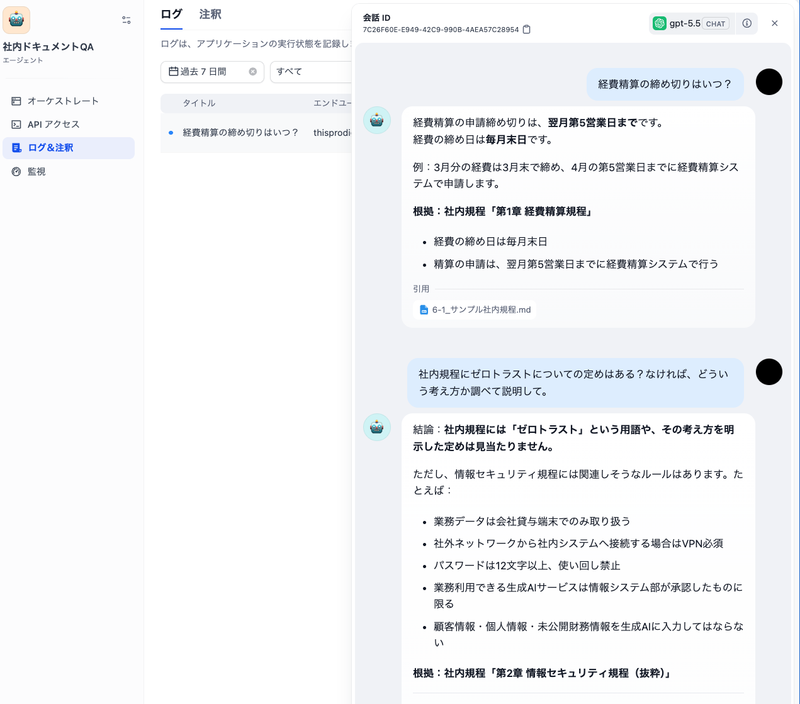

# 6-1 Difyでエージェント型の質問応答Botを組む — 画面操作手順

本書 第6章 6-1節の詳細手順。本文では「モデルに何を渡すと、どういうBotになるか」という構造だけを説明し、画面ごとの操作はこのファイルにまとめる。

> **バージョンについて**
> Difyはバージョンアップが速く、メニューの名称・画面の配置は版によって変わる。
> 本手順は執筆時点（2026年7月、Dify 1.x系）の構成に基づく。画面が一致しない場合は
> 公式ドキュメント（https://docs.dify.ai/）で現行版の手順を確認すること。

> **画像について**
> 既存の画像は執筆時点の操作例です。モデルプロバイダー設定・文書アップロード・処理完了の3画面は未収録のため、以下の文章で操作と確認ポイントを示します。

## 0. 前提

**Dify環境**（どちらか一方）

- クラウド版：https://cloud.dify.ai にサインアップ（利用枠とモデル・埋め込み処理の費用を事前に確認する）
- セルフホスト版：

  ```bash
  git clone https://github.com/langgenius/dify
  cd dify/docker
  cp .env.example .env
  docker compose up -d
  ```

  起動後 `http://localhost/install` で管理者アカウントを作成。

**モデルプロバイダーの登録**

右上のアカウントアイコン →「設定」→「モデルプロバイダー」で、使用するプロバイダー（Anthropic、OpenAIなど）のAPIキーを登録する。**ツール呼び出し（Function Calling）に対応したモデル**を使うこと。

> **スクショ01**：「設定」→「モデルプロバイダー」画面。使用プロバイダー（例：Anthropic）が「設定済み」になっている状態。APIキー入力欄が写る場合はキーを必ずマスク。見せたいこと＝「アプリを作る前にモデルの接続が要る」。

**ナレッジに登録するサンプル文書**

同じフォルダの `6-1_サンプル社内規程.md`（架空の社内規程）を使う。

## 1. ナレッジ（知識）を作る

1. 上部メニュー「ナレッジ」→「ナレッジを作成」
2. 「テキストファイルからインポート」で `6-1_サンプル社内規程.md` をアップロード
3. チャンク設定・インデックス方式を確認して「保存して処理」。高品質インデックスを選ぶ場合は、利用する埋め込みモデルの設定が必要
4. ステータスが「利用可能」になるまで待つ（処理時間は文書量や環境により異なる）

> **スクショ02**：ナレッジ作成画面。`6-1_サンプル社内規程.md` をアップロードした直後（ファイル名が表示され、チャンク設定がデフォルトのまま）の状態。見せたいこと＝「ファイルを放り込むだけでRAGの検索対象になる」。

> **スクショ03**：ナレッジのドキュメント一覧で、ステータスが「利用可能」になった状態。見せたいこと＝「処理完了の確認ポイント」。（02と統合して1枚でも可）

## 2. Wikipediaツールをインストールする

1. マーケットプレイス（上部メニュー「ツール」からも辿れる）で「Wikipedia」を検索
2. **langgenius製の「Wikipedia」プラグイン**をインストール
   - https://marketplace.dify.ai/plugin/langgenius/wikipedia
   - 執筆時点では、認証情報（APIキー等）の登録は不要

Dify v1.0以降、ツールはすべてプラグイン化されており、初回はマーケットプレイスからのインストールが必要。


> **スクショ04**：マーケットプレイスで「Wikipedia」を検索した結果。langgenius製プラグインのカード（作者名・インストール数が見える状態）と「インストール」ボタン。見せたいこと＝「公式プラグインを数クリックで追加できる」「langgenius製を選ぶ」。

## 3. エージェント型アプリを作る

1. 「スタジオ」→「最初から作成」→ アプリの型で**「エージェント」**を選択
2. 名前：（例）社内ドキュメントQA



> **スクショ05**：「最初から作成」のアプリ型選択ダイアログで「エージェント」を選択した状態。チャットボット／エージェント／ワークフロー等の型が並んで見えること。見せたいこと＝「本文6-1の『アプリの型』が実際に選択肢として並んでいる」。

3. 「手順」（指示・プロンプト）に次を貼り付ける：

   ```
   あなたは社内の質問に答えるアシスタントです。
   社内ドキュメント（ナレッジ）とWikipediaを参照できます。
   根拠にした情報源がわかるように答えてください。
   ```

   **重要**：「まずナレッジを調べ、なければWikipediaを調べる」といった**手順は意図的に書かない**。どの道具をどの順で使うかはモデルに委ねる（本文6-1の要点）。

4. 「コンテキスト」に手順1で作ったナレッジを追加
5. 「ツール」に手順2でインストールしたWikipediaを追加
6. モデルを選択（Function Calling対応モデル）



> **スクショ06**：エージェントアプリの編集画面全体。「手順（指示）」に上記プロンプト、「コンテキスト」に「サンプル社内規程」、「ツール」に「Wikipedia」、右上にモデル名、の4点が1画面に揃った状態。見せたいこと＝**本文6-1の「用意するのは4つだけ（知識・ツール・指示・モデル）」と画面が一対一に対応すること**。この手順書の中で最も重要な1枚。

7. 「エージェント設定」で推論モード（Function Calling / ReAct）を確認する。Function Callingのままでよい。このラベルの意味は本文6-1〜6-3の主題



> **スクショ07**：「エージェント設定」を開き、推論モードの選択肢として「Function Calling」と「ReAct」が並んで見える状態。見せたいこと＝**本文の伏線「設定画面に現れるReActというラベル」の現物**。選択肢2つが読める解像度で撮ること。

## 4. 動かして観察する

右側の「デバッグとプレビュー」で、次の2つを順に試す。以下は観察したい挙動の例であり、モデルによって呼び出すツール・順序・回数は変わる。実際のログと照合して確認する。

**質問1（知識だけで足りる）**

> 経費精算の締め切りはいつ？

期待される挙動：ナレッジ検索1回 → 規程を根拠に回答（締め日は毎月末日、申請は翌月第5営業日まで）。



> **スクショ08**：質問1の応答。回答上部の思考過程・ツール呼び出し表示を**展開した状態**で、ナレッジ検索が1回だけ呼ばれていることと最終回答が1画面に収まっていること。見せたいこと＝「知識で足りるときは1手で終わる」（質問2との対比の基準）。

**質問2（知識が空振り → Wikipediaへ）**

> 社内規程にゼロトラストについての定めはある？なければ、どういう考え方か調べて説明して。

期待される挙動：ナレッジ検索 → 該当なしと判断 → Wikipediaで「ゼロトラスト」を検索 → 「規程に定めはないが、一般には……」とまとめて回答。



> **スクショ09**：質問2の応答。思考過程を展開し、**①ナレッジ検索 → ②Wikipedia呼び出し、の2段が順に並んでいる状態**。それぞれの呼び出しの入力（検索語）と返り値の冒頭が読めること。見せたいこと＝**本文6-1の「足取り」の現物。この章全体の謎の設置になる1枚**。
> **【本文図版を兼ねる】** この1枚は書籍本文の**図6-1-2**としてそのまま掲載する（`images/図6-1-2_実行ログの足取り.png`）。再撮影する際は、質問文・ナレッジ検索・Wikipedia呼び出し・最終回答の4要素を確認する。

**見るべきポイント**

- 回答の上部（またはログ）に展開される、エージェントの思考過程とツール呼び出しの記録
- 質問2で、**1つ目のツールの結果を見てから**2つ目のツールを選んでいること
  （＝本文6-2のThought→Action→Observationの循環。本文6-3の `while` ループの「2周目」に対応）
- 左メニュー「ログ」から、過去の実行の足取りを後から追えること（本文6-5の観測性に対応）



> **スクショ10**：アプリ左メニューの「ログ」画面。質問1・質問2の実行履歴が一覧に残り、1件を開くと入出力・所要時間等が確認できる状態（一覧＋詳細のどちらか読みやすい方）。見せたいこと＝「観測はDifyに内蔵されている」（本文6-5への伏線）。

## 5. うまく動かないとき

| 症状 | 対処 |
|------|------|
| モデルがツールを使わず即答する | ツール呼び出し対応モデルか確認。質問を「社内規程では〜」と明示的にする |
| 質問2でWikipediaを呼ばない | 指示に「わからないことは調べてから答えてください」を1行追記（それでも手順は書かない） |
| ナレッジ検索がヒットしない | ナレッジの処理完了（利用可能）を確認。チャンク設定をデフォルトに戻して再取り込み |
| 画面の名称が本手順と違う | 公式ドキュメントで現行版の名称を確認（冒頭のバージョン注記を参照） |

## スクリーンショット一覧（収録・再撮影の確認用）

| # | ファイル名 | 内容 | 優先度 |
|---|-----------|------|--------|
| 01 | `01_model_provider.png` | モデルプロバイダー設定済み | 未収録（文章で説明） |
| 02 | `02_knowledge_upload.png` | ナレッジへのファイルアップロード | 未収録 |
| 03 | `03_knowledge_ready.png` | ナレッジ「利用可能」 | 未収録 |
| 04 | `04_marketplace_wikipedia.png` | マーケットプレイスのWikipediaプラグイン | 中 |
| 05 | `05_create_agent_app.png` | アプリ型で「エージェント」を選択 | 中 |
| 06 | `06_agent_config_overview.png` | 指示・知識・ツール・モデルが揃った編集画面 | **高** |
| 07 | `07_agent_mode_react_label.png` | Function Calling / ReAct のラベル | **高** |
| 08 | `08_run_q1_single_tool.png` | 質問1（ツール1回）の思考過程 | 中 |
| 09 | `09_run_q2_two_tools_trajectory.png` | 質問2（ナレッジ→Wikipedia）の足取り | **最高**（本文図6-1-2を兼ねる。上記4要素を確認） |
| 10 | `10_logs_view.png` | ログ画面 | 中 |
