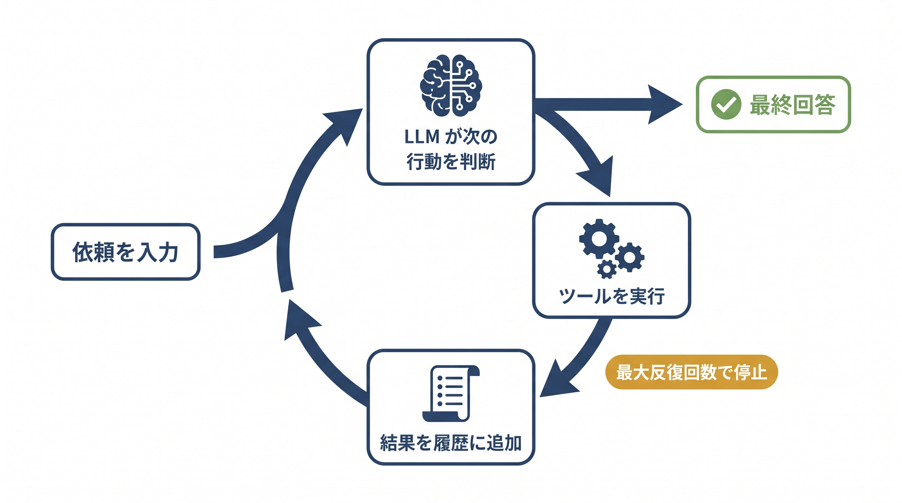

# 第6章 エージェントを裸で書く — サンプル

本書 第6章のハンズオン素材と掲載コードです。この章のサンプルでは次のことを確かめられます。

- Difyの画面設定だけで組んだBotが、手順を書いていないのに道具を選び直す「足取り」（6-1）
- 同じ動きを素のコードで再現する、`while` ループの最小エージェント（6-3）
- 停止条件（最大反復回数）とステップごとのログを足した観測できるループ（6-4／6-5）

ファイル名の先頭は対応する節番号です（例 `6-1_` = 6-1節）。



## 収録ファイル

| ファイル | 本文の節 | 確かめられること | APIキー |
| --------- | --------- | ---------------- | -------- |
| [`6-1_dify_cloud_handson.md`](6-1_dify_cloud_handson.md) | 6-1 | Difyクラウド版（ブラウザのみ）で質問応答Botを実際に組んで動かす手順 | Dify側でモデル設定が必要（無料枠モデルで代替できる場合あり） |
| [`6-1_dify_agent_setup.md`](6-1_dify_agent_setup.md) | 6-1 | Difyの画面ごとの詳細な操作手順（クラウド版・セルフホスト版共通） | 同上 |
| [`6-1_サンプル社内規程.md`](6-1_サンプル社内規程.md) | 6-1 | 上記手順でナレッジに登録する架空の社内規程 | 不要 |
| `6-3_agent_loop_minimal.py` | 6-3 | 最小エージェントループ。`while True` で tool_use をさばき、最終回答で抜ける。コード内の (a)〜(d) は本文と対応 | なしでドライラン可 |
| `6-4_agent_loop_observable.py` | 6-4 | 6-3 に停止条件（最大反復回数）を足した版。`for ... else` で上限到達を検知 | なしでドライラン可 |
| `6-5_agent_loop_observable.py` | 6-5 | 6-4 にさらにステップごとのログ（stop_reason・トークン・道具呼び出し）を足した版 | なしでドライラン可 |
| `interactive_agent_loop.py` | （本文になし） | 自分の質問を入力して、ループの各ステップ（LLM呼び出し→ツール選択→実行→最終回答）を観察する。**本リポジトリ限定の追加教材** | なしでドライラン可 |

Pythonサンプルのツールは在庫照会 `get_stock` のみで、ダミー在庫は A-100=0（品切れ）、B-200=15（在庫あり）です。

## 前提

- Python 3.10 以上（動作確認は 3.12）
- パッケージ管理は uv を推奨します（venv + pip でも同じことができます）
- ドライラン（APIキーなし）は追加パッケージなしの標準ライブラリだけで動きます
- 6-1 のDifyハンズオンはブラウザだけで完結し、Python環境は不要です

## セットアップ

ドライランだけならセットアップ不要です。本番モード（実際にモデルを呼ぶ）に使う `anthropic` パッケージを入れる場合は次のとおりです。

```bash
cd samples

# uv の場合
uv venv .venv
uv pip install --python .venv -r requirements.txt
source .venv/bin/activate        # Windows は .venv\Scripts\activate

# venv + pip の場合
python3 -m venv .venv
source .venv/bin/activate        # Windows は .venv\Scripts\activate
pip install -r requirements.txt
```

## APIキーなしで動かす（ドライラン）

`ANTHROPIC_API_KEY` が未設定なら、APIは呼ばずにループの流れだけをシミュレートして表示します。

```bash
python 6-3_agent_loop_minimal.py
python 6-4_agent_loop_observable.py
python 6-5_agent_loop_observable.py
```

期待される出力の要点は次のとおりです。

`6-3_agent_loop_minimal.py` は、「A-100の在庫確認 → 品切れ → 代替品B-200を確認 → 在庫あり → 最終回答」という2周のループを、本文の (a)〜(d) のラベル付きで表示します。

```text
[メモ] ANTHROPIC_API_KEY 未設定のため、API は呼ばずに流れだけを表示します。
(a) 1回目の問い合わせ → モデルは get_stock を要求（stop_reason='tool_use'）
(c) アプリがツールを実行：get_stock(product_code='A-100') -> '0'
...
(b) 次の問い合わせでモデルは道具を要求しない（stop_reason は tool_use 以外）
(d) ループを抜ける → 最終回答（例：『商品A-100は品切れですが、代替品B-200が15個あります』）
```

`6-4_agent_loop_observable.py` は、上限つきループの2つの止まり方（break による正常終了と、`for ... else` が発火する上限到達）を表示します。

`6-5_agent_loop_observable.py` は、本文 6-5 の「期待される記録」と同じ形のステップログを再現します。

```text
[step 0] stop_reason=tool_use tokens(in/out)=512/45
[step 0] tool=get_stock input={'product_code': 'A-100'} -> 0
[step 1] stop_reason=tool_use tokens(in/out)=580/48
[step 1] tool=get_stock input={'product_code': 'B-200'} -> 15
[step 2] stop_reason=end_turn tokens(in/out)=640/60
```

## ANTHROPIC_API_KEY を使って動かす（任意）

セットアップ済みの環境でAPIキーを設定すると、実際にClaudeがループを自走させます。

```bash
export ANTHROPIC_API_KEY=sk-ant-...      # Windows（cmd）は set ANTHROPIC_API_KEY=... Windows（powershell）は $env:ANTHROPIC_API_KEY="..."
python 6-3_agent_loop_minimal.py
python 6-4_agent_loop_observable.py
python 6-5_agent_loop_observable.py
```

キーが未設定、または `anthropic` 未導入のときは自動でドライランに切り替わります。実行前に次の4点を確認してください。

- **従量課金です**。1回の実行はループ2〜3周・入出力合わせて数千トークン程度が目安ですが、料金はモデルと実際の使用量で決まります。Anthropicの料金ページで確認してください
- **モデル名は廃止されることがあります**。モデル名は `6-3_agent_loop_minimal.py` 冒頭の `MODEL`（執筆時点は `claude-sonnet-4-6`）の1か所で管理していて、`6-4_`・`6-5_`・`interactive_agent_loop.py` はこれを共有します。モデルが見つからないというエラーが出たら、公式ドキュメントで現行のモデル名を確認して `6-3_` の `MODEL` を書き換えてください。確かめたいのは「ツール使用をループで回す骨格」であり、これはモデルが替わっても変わりません
- **入力はAnthropicのAPIに送信されます**。依頼文やツール結果がAPIに送られるため、業務上の秘密情報を含む文字列は使わないでください
- **出力は毎回変わります**。モデルの回答は非決定的で、本READMEの出力例と一字一句は一致しません。ループの回数（何周で最終回答に至るか）が変わることもあります

## 自分で確かめる（対話型サンプル）

`interactive_agent_loop.py` は本リポジトリ限定の追加教材です（書籍本文には登場しません）。自分で入力した質問に対してエージェントループが回る様子を、1ステップずつ観察できます。

```bash
python interactive_agent_loop.py                # キーがあれば本番、なければドライラン
python interactive_agent_loop.py --max-steps 5  # ループ上限の変更（本文 6-4 の停止条件）
```

- `質問>` プロンプトに質問を入力します。空行またはCtrl+Cで終了します
- 使える道具は `get_stock` だけなので、「A-100の在庫は？品切れなら代替品B-200も調べて」のような質問だとループが複数回回る様子を観察できます。在庫と無関係な質問では、道具を使わず1ステップで答える様子が見られます
- APIキーなしの場合は、入力によらず固定の筋書きでループの形だけを再現します
- `6-3_agent_loop_minimal.py` の `get_stock` 内のダミー在庫を書き換えると、モデルの道具の呼び分け方が変わる様子も試せます

Difyのハンズオンを自分の手で確かめたい場合は [`6-1_dify_cloud_handson.md`](6-1_dify_cloud_handson.md) に進んでください。

## うまくいかないとき

| 症状 | 対処 |
| ------ | ------ |
| `ModuleNotFoundError: No module named 'anthropic'` | ドライランには不要です。本番モードにするにはセットアップの手順でインストールしてください |
| キーを設定したのにドライランになる | `echo $ANTHROPIC_API_KEY`（Windows は `echo %ANTHROPIC_API_KEY%`）で同じシェルに設定されているか確認してください |
| `not_found_error` などモデル名に関するエラー | モデル名の世代交代です。`6-3_agent_loop_minimal.py` の `MODEL` を現行モデル名に書き換えてください |
| 認証エラー（401） | APIキーの値を確認してください。キーはAnthropicのコンソールで発行します |
| `6-4_`・`6-5_` や `interactive_` の起動時に import エラー | これらのファイルは `6-3_agent_loop_minimal.py` を読み込みます。`samples` フォルダの中で実行してください |
| Difyの画面が手順書と違う | UIは変わり得ます。`6-1_dify_agent_setup.md` 冒頭のバージョン注記を参照してください |
