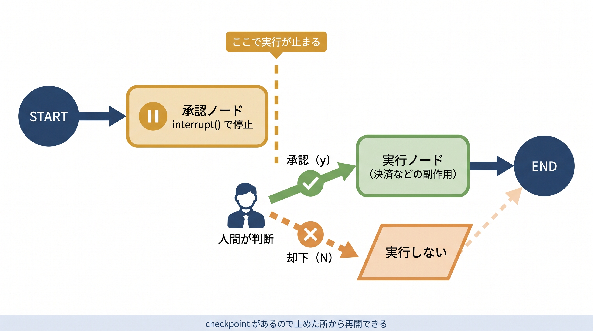

# 第7章 LangGraphの最小セット — サンプルコード

本書 第7章の掲載コードを、そのまま実行できる形にまとめたものです。この章のサンプルでは次のことを確かめられます。

- 状態・ノード・エッジで組む最小のグラフの型（7-3）
- 第6章で手書きしたReActループを、StateGraph（条件分岐＋戻り線）で組み直したもの（7-5）
- Checkpoint（`thread_id` で会話を覚える）と interrupt（止めて人間の承認を待つ）（7-6）
- 組んだグラフを LangSmith Studio で図として可視化する入口（7-7）

本文では「状態・ノード・エッジ・分岐・戻り線」という構造に集中するため、モデルやツールの準備といった周辺コードを省いて骨格だけを掲載しています。ここではその周辺コードを補って実際に動かせるようにし、あわせて実行の流れを追うトレース解説（本文から移設）を各ファイルのコメントと本READMEの「コードの読み方」に置いています。ファイル名の先頭は対応する節番号です（例 `7-5_` = 7-5節）。



## 収録ファイル

| ファイル | 本文の節 | 確かめられること | APIキー |
| --------- | --------- | ---------------- | -------- |
| `7-3_minimal_graph.py` | 7-3 | 状態1つ・1ノードの最小グラフ。4ステップ（状態→ノード→エッジ→コンパイル）の型 | 不要 |
| `7-5_react_graph.py` | 7-5 | 手書きReActをStateGraphで組み直した版。モデルノード・ツールノード・条件分岐・戻り線 | なしでドライラン可（擬似モデル） |
| `7-6_checkpoint.py` | 7-6 | InMemorySaver＋`thread_id` で会話を継続。同じIDは前回を覚え、別IDはまっさら | 不要 |
| `7-6_interrupt.py` | 7-6 | `interrupt` で止め、`Command(resume=値)` で再開するHITLの往復。承認・却下の両方を自動実演 | 不要 |
| `interactive_interrupt.py` | （本文になし） | 7-6のinterruptを、実際にキーボードで承認/却下して体感する対話版。**本リポジトリ限定の追加教材** | 不要 |
| `7-7_studio_app.py` ＋ `langgraph.json` | 7-7 | LangSmith Studioに映す可視化対象グラフ（7-5のループ）。単体実行でMermaid出力も可 | 単体実行は不要。StudioはLangSmithの接続設定が必要 |

## 前提

- Python **3.12.12 を推奨**。以下のuv手順で検証に使ったバージョンを指定できます（Studioの開発サーバーは3.11以上が必要）
- パッケージ管理は uv を推奨します（venv + pip でも同じことができます）
- langgraph 0.2 以上／langchain-core 0.3 以上（`requirements.txt`）。第6章と違い、**ドライランにもこの2つのインストールが必要**です

## セットアップ

リポジトリのルートから、使っているOS・シェルに対応するブロックだけを実行してください。

### uv を使う場合（推奨：Python 3.12.12を指定）

`uv python install` でPython 3.12.12を用意し、`uv venv --python 3.12.12` でそのバージョンの仮想環境を作ります。仮想環境を有効化した後、`python --version` が `Python 3.12.12` と表示されることを確認してから、依存パッケージを導入してください。

macOS / Linux（bash・zsh）:

```bash
cd chapters/07_LangGraphの最小セット/samples
uv python install 3.12.12
uv venv --python 3.12.12
source .venv/bin/activate
python --version
uv pip install -r requirements.txt
```

Windows（コマンドプロンプト / cmd）:

```bat
cd chapters/07_LangGraphの最小セット/samples
uv python install 3.12.12
uv venv --python 3.12.12
.venv\Scripts\activate.bat
python --version
uv pip install -r requirements.txt
```

Windows（PowerShell）:

```powershell
cd chapters/07_LangGraphの最小セット/samples
uv python install 3.12.12
uv venv --python 3.12.12
.\.venv\Scripts\Activate.ps1
python --version
uv pip install -r requirements.txt
```

### uv がない場合（標準の venv + pip）

Python 3.12.12が既にインストールされている方向けです。最初のバージョン確認で `Python 3.12.12` と表示されることを確認してから、仮想環境を作成してください。別のバージョンが表示される場合は、上のuv手順を使うと3.12.12を指定できます。有効化後にも同じバージョンが表示されることを確認します。

macOS / Linux（bash・zsh）:

```bash
cd chapters/07_LangGraphの最小セット/samples
python3 --version
python3 -m venv .venv
source .venv/bin/activate
python --version
python -m pip install -r requirements.txt
```

Windows（コマンドプロンプト / cmd）:

```bat
cd chapters/07_LangGraphの最小セット/samples
python --version
python -m venv .venv
.venv\Scripts\activate.bat
python --version
python -m pip install -r requirements.txt
```

Windows（PowerShell）:

```powershell
cd chapters/07_LangGraphの最小セット/samples
python --version
python -m venv .venv
.\.venv\Scripts\Activate.ps1
python --version
python -m pip install -r requirements.txt
```

## APIキーなしで動かす（ドライラン）

Pythonスクリプトの単体実行はAPIキーなしで動きます。StudioのWeb UIを使う場合のアカウント要件は後述します。`7-5_` は擬似モデル（FakeReActModel）が「A-100を確認 → 品切れ → B-200を確認 → 在庫あり → 最終回答」というReActループを回し、それ以外はそもそもLLMを使いません。

```bash
python 7-3_minimal_graph.py
python 7-5_react_graph.py
python 7-6_checkpoint.py
python 7-6_interrupt.py
python 7-7_studio_app.py     # Studio に映すグラフ構造を Mermaid で出力
```

期待される出力の要点は次のとおりです。

### `7-3_minimal_graph.py`

```text
{'value': '処理 された'}
```

### `7-5_react_graph.py`

```text
[メモ] ANTHROPIC_API_KEY 未設定のため、擬似モデルで流れだけを表示します。

[HumanMessage] 商品A-100の在庫を確認して。品切れなら代替品B-200の在庫も調べて、まとめて報告して。
[AIMessage] tool_calls=[{'name': 'get_stock', 'args': {'product_code': 'A-100'}, 'id': 'call-a', 'type': 'tool_call'}]
[ToolMessage] 0
[AIMessage] tool_calls=[{'name': 'get_stock', 'args': {'product_code': 'B-200'}, 'id': 'call-b', 'type': 'tool_call'}]
[ToolMessage] 15
[AIMessage] 商品A-100は品切れですが、代替品B-200が15個あります。
```

ダミー在庫は A-100=0（品切れ）、B-200=15（在庫あり）です。擬似モデルはこの在庫に対応する固定シナリオです。在庫値だけを書き換えても、呼び出し順と最終回答は変わりません。条件に応じた判断を試す場合は、下記の実モデルを使う手順を参照してください。

### `7-6_checkpoint.py`

```text
[thread-1]
  user> こんにちは、私はボブです。
  bot > こんにちは。
  user> 私の名前は何でしたか？
  bot > あなたの名前はボブです。

[thread-2]（別スレッド＝記憶なし）
  user> 私の名前は何でしたか？
  bot > まだ名前を教わっていません。
```

### `7-6_interrupt.py`

```text
[承認するケース]
  一時停止: 「10000円の決済を承認しますか？」
  人間の判断: 承認 → Command(resume=True) で再開
    → 決済を実行しました（10000円）

[却下するケース]
  一時停止: 「10000円の決済を承認しますか？」
  人間の判断: 却下 → Command(resume=False) で再開
    → 却下されたので何もしません
```

### `7-7_studio_app.py`（単体実行）

`model`・`tools` のノード、`model` からの条件分岐（点線）、`tools→model` の戻り線を含むグラフ構造がMermaid記法で表示されます。Studioではこれが図として描かれます。

## ANTHROPIC_API_KEY を使って動かす（任意）

`7-5_react_graph.py` だけは、APIキーを設定すると擬似モデルの代わりに実際のClaudeがループを自走させます。追加で `langchain` と `langchain-anthropic` が必要です。

仮想環境を有効化した状態で、セットアップ時に選んだ方法に合わせて追加パッケージを導入します。

uvの場合（全シェル共通）:

```text
uv pip install --python .venv langchain langchain-anthropic
```

標準venvの場合（全シェル共通）:

```text
python -m pip install langchain langchain-anthropic
```

続いて、使っているシェルのブロックだけを実行します。`sk-ant-...` は自分のAPIキーに置き換えてください。

macOS / Linux（bash・zsh）:

```bash
export ANTHROPIC_API_KEY="sk-ant-..."
python 7-5_react_graph.py
```

Windows（コマンドプロンプト / cmd）:

```bat
set "ANTHROPIC_API_KEY=sk-ant-..."
python 7-5_react_graph.py
```

Windows（PowerShell）:

```powershell
$env:ANTHROPIC_API_KEY="sk-ant-..."
python 7-5_react_graph.py
```

キーが未設定、または依存が未導入のときは自動でドライランに切り替わります。実行前に次の4点を確認してください。

- **従量課金です**。1回の実行はループ2〜3周・入出力合わせて数千トークン程度が目安ですが、料金はモデルと実際の使用量で決まります。Anthropicの料金ページで確認してください
- **モデル名は廃止されることがあります**。モデル名は `7-5_react_graph.py` の `build_model()` 内の `init_chat_model("claude-sonnet-4-6", ...)` の1か所です。モデルが見つからないというエラーが出たら、公式ドキュメントで現行のモデル名を確認して書き換えてください。確かめたいのは「状態・ノード・エッジでループを組む骨格」であり、これはモデルが替わっても変わりません
- **入力はAnthropicのAPIに送信されます**。質問文やツール結果がAPIに送られるため、業務上の秘密情報を含む文字列は使わないでください
- **出力は毎回変わります**。モデルの回答は非決定的で、上記の出力例と一字一句は一致しません。ループの回数が変わることもあります

## 自分で確かめる（対話型サンプル）

`interactive_interrupt.py` は本リポジトリ限定の追加教材です（書籍本文には登場しません）。`7-6_interrupt.py` が承認・却下を自動実演するのに対し、こちらはinterruptで止まったグラフを**実際に自分のキーボード入力で再開**します。LLMもネットワークも不要です。

```bash
python interactive_interrupt.py
```

- 決済金額を入力すると、グラフが `interrupt` で一時停止し、`[y/N]` の承認待ちになります
- `y` で承認（決済を実行するノードへ進む）、`n` または空Enterで却下です
- 金額入力で空行を入れるか、Ctrl+Cで終了します
- 「グラフが止まっている間、プログラムは入力をいつまでも待てる」——interruptの状態保存が何を可能にするかを、自分の指で確かめられます

### LangSmith Studio でグラフを可視化する（任意）

7-7のStudio可視化を手元で試すには、LangGraphのCLI（開発サーバ）を入れて `langgraph dev` を起動します。`langgraph.json` が `7-7_studio_app.py` のグラフを指しているので、7-5の「モデル→ツール→モデル」ループがStudioに図示されます。

Python 3.12.12 の仮想環境を有効化して実行してください。uvで作った仮想環境にはpipが入っていないことがあるため、ここでは `uv pip` を使います。標準のvenvを使う場合は `python -m pip install -U "langgraph-cli[inmem]"` でも導入できます。

[公式のローカル開発手順](https://docs.langchain.com/langsmith/local-dev-testing)ではLangSmithのAPIキーを前提としています。Studioにサインインし、必要なLangSmithの接続設定を行ってください。LLM用の `ANTHROPIC_API_KEY` とは別です。実行トレースを送信しない場合は `LANGSMITH_TRACING=false` にします。

```bash
uv pip install --python .venv -U "langgraph-cli[inmem]"
langgraph dev        # samples フォルダで実行（langgraph.json を読む）
```

起動するとStudioを開くURLが表示されます。ブラウザでアクセスすると `model`・`tools` のノードと条件分岐・戻り線が図として表示され、`7-5_react_graph.py` を編集すると図も追従します（ホットリロード）。GUIなしでグラフ構造だけ見るなら `python 7-7_studio_app.py` で同じ構成をMermaid記法で確認できます。

## コードの読み方（実行の流れのトレース解説）

本文 7-3〜7-6 では「見るべきポイント」だけに絞ったぶん、実行が実際にどう流れるかはここでまとめて追います。各ファイルのコード内コメントにも同じ解説があります。

### `7-3_minimal_graph.py` ── 4ステップと1周の流れ

コードの (1)〜(4) が本文の4ステップに対応します。(1) `State`（TypedDict）で黒板の形を決め、(2) `my_node` がノード＝「黒板を受け取り、更新分だけ返す関数」、(3) `add_node`／`add_edge` で処理と流れを**別々に**登録し、(4) `compile()` で実行できる形にします。

実行時は `invoke({"value": "処理"})` の初期状態が黒板に置かれ、START → `my_node`（黒板を読み、`{"value": "処理 された"}` を返す）→ 更新分が黒板に反映 → END、と流れて、最終的な黒板の中身が戻り値になります。

### `7-5_react_graph.py` ── ReActループが1周する順序

ドライランでは、`invoke` 1回の中でノードを次の順に巡ります。

1. START → **model ノード（1周目）**：モデルが「A-100 の在庫を確認したい」と tool_use を返す
2. **should_continue**：`tool_calls` あり → `"tools"` へ（分かれ道）
3. **tools ノード**：`get_stock("A-100")` → `0`（品切れ）を会話に追記
4. 固定エッジで **model へ戻る**（★前章の while ループの戻りにあたる線）
5. **model ノード（2周目）**：品切れを見て「B-200 も確認したい」と tool_use
6. **tools ノード**：`get_stock("B-200")` → `15`（在庫あり）を追記 → model へ戻る
7. **model ノード（3周目）**：材料が揃い、最終回答（`tool_calls` なし）を返す
8. **should_continue**：`tool_calls` なし → **END**

どの周でも `messages.append` を書いていない点に注目してください。ノードは「追記したい分」を返すだけで、積む作業はリデューサ `add_messages` が行います。`recursion_limit` はこのループのステップ数上限です（本文 7-4）。

### `7-6_checkpoint.py` ── thread_id と黒板の復元

1回目の `invoke`（thread-1）でまっさらな黒板に会話が積まれ、節目で保存されます。2回目（同じ thread-1）では保存済みの黒板が**復元されてから**ノードが動くので、`respond` は過去の発言から名前を見つけられます。3回目（thread-2）は別の黒板なので何も覚えていません。「`messages` を自分で持ち回って渡す」作業が「`thread_id` を指定する」に置き換わったことを、出力で確かめられます。

### `7-6_interrupt.py` ── 止めて、待って、再開する往復

1回目の `invoke` は `approval_node` の `interrupt(...)` で一時停止します。このとき状態はチェックポインターに保存され、payload（質問文）が `result["__interrupt__"]` に入ります。人間が判断したら、**同じ `thread_id`** で `Command(resume=判断)` を渡して再開します。すると `approval_node` が**頭から再実行**され、今度は `interrupt()` が resume の値を返して先へ進みます。「頭から再実行」されるからこそ、副作用（決済）は承認後の `execute_node` に分けてあります（本文 7-6 の注意点）。

## うまくいかないとき

| 症状 | 対処 |
| ------ | ------ |
| `ModuleNotFoundError: No module named 'langgraph'` | セットアップの手順で `requirements.txt` をインストールし、仮想環境を有効化した状態で実行してください |
| `7-7_studio_app.py` の起動時に import エラー | `7-5_react_graph.py` を読み込みます。`samples` フォルダの中で実行してください |
| `langgraph dev` が見つからない | `uv pip install --python .venv -U "langgraph-cli[inmem]"` を実行してください（`requirements.txt` には含めていません） |
| 本番モードにならない | `langchain` と `langchain-anthropic` の追加インストールと、同じシェルでの `ANTHROPIC_API_KEY` 設定を確認してください |
| モデル名に関するエラー（`not_found_error` 等） | モデル名の世代交代です。`7-5_react_graph.py` の `init_chat_model(...)` を現行モデル名に書き換えてください |
| `interactive_interrupt.py` で同じ金額を2回入力すると様子が違う | 実行ごとに `thread_id` を変えて新しいグラフを作っているため、通常は毎回同じ動きです。もし改造して `thread_id` を固定すると、完了済みスレッドを再利用してしまう点に注意してください |
