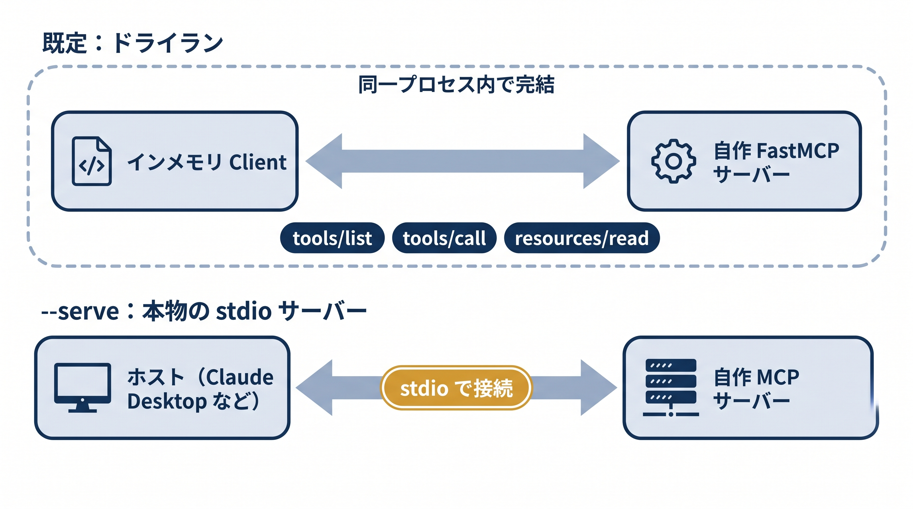

# 第8章 自作MCPサーバーを書く — サンプルコード

本書 第8章の掲載コードを、そのまま実行できる形にまとめたものです。この章のサンプルでは次のことを確かめられます。

- 道具を1つ公開する最小のMCPサーバーが、3点構成（サーバー作成・`@mcp.tool`・`mcp.run()`）で書けること（8-1）
- ツール・リソース・プロンプトの3分類が、プロトコル上で別々の口として見えること（8-3）
- 社内APIを包むサーバーの型——環境変数から資格情報を読み、`httpx`（非同期）で呼ぶ（8-4）

**この章のサンプルにANTHROPIC_API_KEYは不要です**（LLMを呼びません）。ネットワークも不要で、すべて手元で完結します。

本文では「サーバーがどんな部品でできているか」という構造に集中するため、動かすための周辺コードを省いて骨格だけを掲載しています。ここではその周辺コードを補い、実際に動かせるようにしています。あわせて、本文で割愛したコードの流れ解説や実務の詳細を「[補足解説](#補足解説--本文で割愛した詳細)」にまとめました。

通常、stdioで動くMCPサーバーは `mcp.run()` で起動し、ホスト（AIアプリ）からの接続を待ち受けます。ただ、それだとホストを用意しないと動きを確認できません。そこで各サンプルは、既定では**ドライラン**として、FastMCPのインメモリClientで自分のサーバーにつなぎ、`tools/list`（道具の一覧）・`tools/call`（実行）・`resources/read`（リソース読み取り）などを確かめます。`--serve` を付けると、本物のstdioサーバーとして起動します（Claude Desktopなどのホストから接続する用）。

ファイル名の先頭は対応する節番号です（例 `8-1_` = 8-1節）。



## 収録ファイル

| ファイル | 本文の節 | 確かめられること | APIキー |
|---------|---------|----------------|--------|
| `8-1_minimal_server.py` | 8-1 | 足し算の道具を1つ公開する最小サーバー。インメモリClientで発見（`tools/list`）と実行（`tools/call`） | 不要 |
| `8-3_primitives.py` | 8-3 | ツール・リソース・プロンプトの3分類を1つのサーバーに同居させた版。テンプレート（`customer://{id}`）も実演 | 不要 |
| `8-4_internal_api_server.py` | 8-4 | 社内APIを `httpx`（非同期）で叩く在庫サーバー。環境変数が未設定ならダミー在庫でドライラン | 不要（社内API接続時のみ `INVENTORY_API_KEY` 等） |

## 前提

- Python 3.10 以上（動作確認は 3.12）
- パッケージ管理は uv を推奨します（venv + pip でも同じことができます）
- fastmcp 3.x（`requirements.txt`。動作確認は 3.4.2、下層の `mcp` は 1.28.1）

> **バージョンは固定する**
>
> 独立パッケージ `fastmcp` は更新が速く、メジャー版の切り替わりで破壊的変更が入ります（v2→v3 でデコレータの書き方やサーバー設定が変わりました）。本書で使う最小の書き方（`@mcp.tool`／`mcp.run()`）は版をまたいで安定ですが、本番では依存版を固定してください。詳しくは補足解説の「[FastMCPの2系統とバージョン固定](#2-fastmcpの2系統とバージョン固定本文8-2の補足)」。

## セットアップ

```bash
cd chapters/08_自作MCPサーバーを書く/samples

# uv の場合
uv venv .venv
uv pip install --python .venv -r requirements.txt
source .venv/bin/activate        # Windows は .venv\Scripts\activate

# venv + pip の場合
python3 -m venv .venv
source .venv/bin/activate        # Windows は .venv\Scripts\activate
pip install -r requirements.txt
```

## 動かす（ドライラン：APIキー・ネットワーク不要）

```bash
python 8-1_minimal_server.py
python 8-3_primitives.py
python 8-4_internal_api_server.py
```

期待される出力の要点は次のとおりです。

### `8-1_minimal_server.py`

```text
[tools/list] 公開中の道具: ['add']
[tools/call] add(2, 3) -> 5
```

ツール定義（名前・説明・引数のスキーマ）を自分で書いていないのに `tools/list` に現れる——関数名・docstring・型ヒントから自動生成されていることが確認できます。

### `8-3_primitives.py`

```text
[tools/list] ['create_ticket']
[tools/call] create_ticket -> {'id': 'TICKET-0001', ...}
[resources/list] ['config://app']
[resource templates] ['customer://{customer_id}']
[resources/read] config://app -> {"version": "1.0", "region": "tokyo"}
[resources/read] customer://12345 -> {"name": "\u5c71\u7530\u592a\u90ce", "plan": "standard"}
[prompts/list] ['summarize_complaint']
```

`customer://12345` の `\u5c71\u7530\u592a\u90ce` は「山田太郎」のJSONエスケープ表記です（リソースの返り値はJSONとして直列化されるため、日本語がこの形で表示されます）。

ツール・リソース・プロンプトが `tools/`・`resources/`・`prompts/` という**別々の口**として見えることが確認できます。

### `8-4_internal_api_server.py`

```text
[tools/list] ['get_stock']
[tools/call] get_stock(A-100) -> {'product_code': 'A-100', 'stock': 0}
[tools/call] get_stock(B-200) -> {'product_code': 'B-200', 'stock': 15}
```

ダミー在庫は A-100=0（品切れ）、B-200=15（在庫あり）です。

## 自分で確かめる（本物のサーバーとして起動する／任意）

`--serve` を付けると、ドライランではなく本物のstdioサーバーとして起動し、ホストからの接続を待ち受けます。

```bash
python 8-1_minimal_server.py --serve   # 8-3_ / 8-4_ も同様
```

起動するとFastMCPのバナーと起動ログが表示されますが、これは標準エラー出力（stderr）へのもので、プロトコルのやり取りに使う標準出力（stdout）には何も出ません（詳細は補足解説の「[stdioサーバーのログの落とし穴](#4-stdioサーバーのログの落とし穴本文8-6の補足)」）。バナー表示後は接続待ちの状態です。動きを見るには、第5章で使ったMCP Inspectorからつなぐのが手軽です。

```bash
npx @modelcontextprotocol/inspector python 8-1_minimal_server.py --serve
```

Claude Desktopなどのホストへの登録方法は本文 8-6 を参照してください。`8-4_` を本物の社内APIにつなぐ場合は、環境変数を渡して起動します。

```bash
export INVENTORY_API_BASE=https://api.example.internal
export INVENTORY_API_KEY=...            # 資格情報はコードに直書きしない
python 8-4_internal_api_server.py
```

このとき何を送っているかにも注意してください。環境変数を設定すると、ツールに渡した商品コードは実際にその接続先へ送信されます。

## うまくいかないとき

| 症状 | 対処 |
|------|------|
| `ModuleNotFoundError: No module named 'fastmcp'` | セットアップの手順でインストールし、仮想環境を有効化した状態で実行してください |
| デコレータ等でエラーが出る | fastmcp のメジャー版違いの可能性があります。`pip show fastmcp` で 3.x が入っているか確認してください（`requirements.txt` は `fastmcp>=3,<4` で固定） |
| `--serve` で起動したのにバナー以降なにも起きない | 正常です。stdioサーバーは接続待ちの状態で、単体ではプロトコルのメッセージを出力しません。Inspectorやホストからつないでください |
| ホストに登録したのに認識されない・すぐ落ちる | 多くは stdout への `print` 混入か、起動コマンドのパス指定誤りです。補足解説の「[stdioサーバーのログの落とし穴](#4-stdioサーバーのログの落とし穴本文8-6の補足)」を参照してください |
| `8-4_` が本物のAPIを叩いてくれない | `INVENTORY_API_BASE` と `INVENTORY_API_KEY` の**両方**が設定されているときだけ本番経路になります |

## 補足解説 ── 本文で割愛した詳細

本文（第8章）はポイント解説に絞っているため、コードの流れの詳しい解説と、実務まわりの詳細（バージョン管理・認証の約束ごと・開発中の落とし穴・配布）はここにまとめます。

### 1. コードの読み方（各サンプルの流れ）

#### `8-1_minimal_server.py`（最小サーバー）

- `FastMCP("demo-server")` でサーバーの入れ物を1つ作り、ふつうの関数 `add` に `@mcp.tool` の目印を付け、`mcp.run()` で起動する——本文どおりの3点構成です。
- ツール定義（名前・説明・引数のJSON Schema）は、関数名（`add`）・docstring（`"""2つの整数を足して返す"""`）・型ヒント（`a: int, b: int`）から自動生成されます。クライアントが `tools/list` を尋ねると、この自動生成された定義が返ります。
- `mcp.run()` の既定は stdio（標準入出力）です。ホストと同じマシンで動くローカルサーバーになります。HTTPで動かす場合は起動時にトランスポートを指定します（指定方法は版により異なるため、使う版の公式ドキュメントを参照）。

#### `8-3_primitives.py`（3分類）

- 1つのサーバーに、ツール（`create_ticket`）・リソース（`config://app`）・リソーステンプレート（`customer://{customer_id}`）・プロンプト（`summarize_complaint`）を同居させています。
- リソーステンプレートは、URIの `{customer_id}` に具体値を当てはめて `customer://12345` のように読みます。関数の引数名とURIのプレースホルダ名が対応します。
- ドライランでは `tools/list`・`tools/call`・`resources/list`・`resources/read`・`prompts/list` を順に叩きます。3分類がプロトコル上で**別々の口**として見えることを、出力で確かめられます。

#### `8-4_internal_api_server.py`（社内API呼び出し）

- 外部への通信は時間がかかるため、ツール関数を `async def` にし、`httpx.AsyncClient` で社内APIを呼びます。`await` で応答を待っている間、サーバーは他の処理を止めずに済みます。
- 接続先（`INVENTORY_API_BASE`）とAPIキー（`INVENTORY_API_KEY`）は環境変数から読みます。コードに直書きすると、リポジトリに秘密情報が残り、漏洩の原因になります。
- `res.raise_for_status()` はHTTPエラー（4xx/5xx）を例外に変えます。`timeout=10.0` とあわせて、「社内APIが遅い・落ちている」ときの挙動を明示的に決めています。
- 返り値は `{"product_code": ..., "stock": ...}` と、必要な情報だけに整形して返します。内部のスタックトレースや接続文字列をそのまま返すと、AI（とその先の利用者）に内部構造が漏れます。失敗した場合も「失敗した」と分かる意味のある形で返すと、エージェントが次の手を決めやすくなります。

### 2. FastMCPの2系統とバージョン固定（本文8-2の補足）

「FastMCP」という名前は、2つのものを指し得ます。

- **公式SDKに同梱されたFastMCP**：MCPの公式Python SDK（パッケージ名 `mcp`）の中に取り込まれているもの。`from mcp.server.fastmcp import FastMCP` で使います。もともとFastMCPの初代（1.0）が2024年に公式SDKへ取り込まれた経緯があります。
- **独立した `fastmcp` パッケージ**：本家のFastMCPとして開発が続いているもの。`from fastmcp import FastMCP` で使います。公式SDK同梱版を出発点に、本番運用向けの機能（各種認証プロバイダ、デプロイ支援、テスト機構、クライアント機能など）を大きく拡張しています。本書・本サンプルはこちらを使います。

最小のツールを書くだけなら、両者の書き味はほとんど同じで、`import` 文の違い程度です。ただし独立版は、MCP仕様の速い変化に追従するため短い周期で更新され、メジャー版の切り替わり（たとえば v2→v3）では、デコレータの書き方やサーバーの設定方法に破壊的変更が入りました。本書で使う最小の書き方（`@mcp.tool`・`mcp.run()`）は版をまたいで安定ですが、本番では `requirements.txt` のように依存版を固定し、「どの版のFastMCP（およびMCP仕様）に依存し、更新にどう追従するか」を決めておいてください。これが塩漬けを避ける勘どころになります。

### 3. 認証・認可の勘どころ（本文8-5の補足）

MCPの認可仕様（HTTPトランスポート・OAuth 2.1ベース）は、安全のための約束ごとをいくつも定めています。主なものは次の3つです。

- **トークンは「このサーバー宛て」のものに限る**：MCPサーバーは、自分宛てに発行されたトークンだけを受け付け、他のサービス宛てのトークンを使い回させてはいけません（トークンの宛先＝オーディエンスの検証）。盗まれたトークンが別のサービスで悪用されるのを防ぐ仕組みです。
- **受け取ったトークンを下流にそのまま流さない**：MCPサーバーがさらに別のAPI（上流）を呼ぶとき、利用者から受け取ったトークンをそのまま転送してはいけません。これを許すと、サーバーが「人の名義を借りた使い走り」（混乱した代理人、confused deputy）として悪用される恐れがあります。社内APIを包むサーバーはまさに「下流のAPIを呼ぶ」立場なので、直接関係する論点です。
- **横取り対策（PKCE）が必須**：認証の途中で通行証の引き換え券を横取りされても悪用できないようにする仕組み（PKCE）が必須とされています（2025年の仕様改訂で必須化。本文5-5参照）。

なお、これらをゼロから実装する必要はありません。FastMCP（独立パッケージ版）は、各種のIDプロバイダ（社内の認証基盤、あるいはGoogle・GitHubなどの認証）と組み合わせるための足場を用意しています。自分で書くのは「社内システムを呼ぶツールの中身」であって、OAuthの仕組みそのものではありません。

出典：Model Context Protocol "Authorization"（仕様 2025-06-18）https://modelcontextprotocol.io/specification/2025-06-18/basic/authorization

### 4. stdioサーバーのログの落とし穴（本文8-6の補足）

自作サーバーで非常によくある落とし穴です。stdio（標準入出力）で動くサーバーでは、**標準出力（stdout）に文字を出力してはいけません**。stdioサーバーは、その標準出力をMCPのメッセージ（JSON-RPC）のやり取りに使っています。そこにデバッグ用の `print(...)` を混ぜると、メッセージが壊れ、サーバーが正しく動かなくなります。

対策は単純で、ログは**標準エラー出力（stderr）に出す**か、ログ専用のライブラリやファイルに書きます（Pythonなら `print(..., file=sys.stderr)` や `logging` を使う）。HTTPで動かす場合はこの制約はありません。

「サーバーをホストに登録したのに認識されない／すぐ落ちる」という症状の多くは、このstdoutへの出力か、起動コマンドのパス指定の誤りが原因です。ホスト側のログ（Claude Desktopなら専用のログファイル）を見ると、サーバーが吐いたエラーを追えます。

※ 本サンプルのドライラン経路が `print` を使っているのは、ドライランがstdioサーバーとしてではなく「ふつうのスクリプト」として動くためです。`--serve` で本物のstdioサーバーとして起動する経路では、`print` を仕込まないでください。

出典：Model Context Protocol "Build an MCP server"（Logging in MCP Servers）https://modelcontextprotocol.io/docs/develop/build-server

### 5. 公開・配布の考え方（本文では扱わない補足）

作ったサーバーを自分以外の人（や他のAIアプリ）に使ってもらうときの段取りです。

- **配布の基本は「起動方法を相手に渡す」こと**。ローカル（stdio）サーバーなら、パッケージ（PythonならPyPI、Node.jsならnpm）として公開しておき、相手は `uvx`／`npx` のようなコマンドで取得して起動します。リモート（HTTP）サーバーなら、どこか（社内クラウドなど）にデプロイし、相手にはURLと接続方法を渡します。実行環境ごと渡せるDockerイメージ配布も、社内ではよく使われます。
- **広く一般に公開するならMCP Registry**。公開MCPサーバーを発見するための公式カタログです（2025年9月プレビュー公開）。保管しているのはサーバー本体ではなく**メタデータと導入方法**で、実体はnpm／PyPI／Dockerなど既存の配布先に置きます。公開には専用CLI（`mcp-publisher`）で名前空間（`io.github.利用者名/サーバー名`）と導入情報を登録します。
- **社内システムを包んだサーバーは一般公開しない**。公式Registryが受け付けるのは、導入方法が公に入手できるサーバーだけで、社内ネットワーク限定のサーバーや私的な配布先に置いたサーバーは対象外です。社内のプライベートなパッケージレジストリ、社内のコンテナレジストリ、あるいは社内向けの独自レジストリなど、**社内に閉じた経路**で配布します。要は、社内システムへの差込口を、社外から発見・取得できる場所に置かないことです。
- **更新の経路を最初に決めておく**。サーバーは一度配って終わりではありません。社内APIの仕様が変わればサーバーも直して配り直します。バージョン管理と再配布の段取りを決めていないと、利用者のホストに古いサーバーが残り続けます。逆に、公開Registryから既製サーバーを取り込んで使う場合は、提供元や保守状況を確かめておくのが安全です（本文5-5のセキュリティの論点と地続き）。

出典：Model Context Protocol Blog "Introducing the MCP Registry"（2025-09-08）https://blog.modelcontextprotocol.io/posts/2025-09-08-mcp-registry-preview/ ／ "The MCP Registry" https://modelcontextprotocol.io/registry/about
