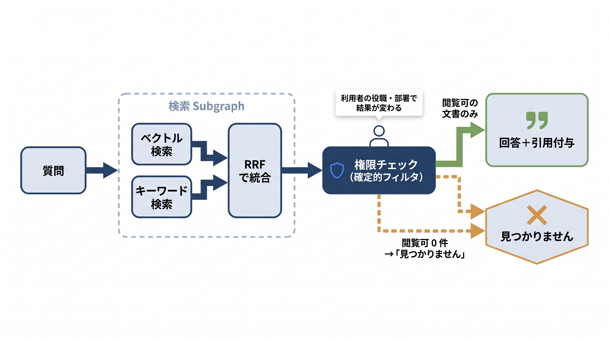

# 第11章 社内ナレッジ横断AIエージェント — サンプルコード

本書 第11章の掲載コードを、手元でそのまま動かせる形にまとめたものです。
この章のエージェントは、社内文書（Confluence・GitHub・SharePoint など）を横断検索し、**利用者が閲覧できる文書だけ**を根拠に、引用元つきで回答するワークフロー型のエージェントです。サンプルでは、検索処理の Subgraph 化（11-4）、複数MCPサーバーの束ね方（11-5）、ハイブリッド検索（11-6）、確定的な権限フィルタと Conditional Edge（11-3）、引用対応表（11-7）、権限のネガティブケース回帰（11-8）を、それぞれ独立に確かめられます。



## 収録ファイル

| ファイル | 対応する本文の節 | 確かめられること | APIキー |
|---------|----------------|----------------|--------|
| `_common.py` | 11-3「権限チェックをどこで行うか」/ 11-6「ハイブリッド検索を組み込む」 | 共通部品（ダミー社内コーパス、擬似ベクトル＋キーワード検索、RRF、リランキング、権限判定 `can_view`）。単体実行はしない | 不要 |
| `11-2_agent_pipeline.py` | 11-2〜11-7 | 検索Subgraph → 権限チェック＋Conditional Edge → 回答＋引用付与を1本につないだ全体版 | 不要 |
| `11-3_permission_filter.py` | 11-3「権限チェックをどこで行うか」 | 同じ質問でも利用者の権限で見える文書が変わること。閲覧可0件なら「見つかりません」経路へ落ちること | 不要 |
| `11-4_subgraph_minimal.py` | 11-4「検索処理をSubgraphに切り出す」 | 検索処理を `compile()` して親グラフの `add_node` にそのまま渡す最小例 | 不要 |
| `11-5_multi_mcp.py` ＋ `mcp_servers/` | 11-5「複数のMCPサーバーを束ねる」 | `MultiServerMCPClient` で2つの自作MCPサーバー（stdio起動）を束ね、`get_tools()` でまとめて取り出して横断検索する | 不要 |
| `11-6_hybrid_search.py` | 11-6「ハイブリッド検索を組み込む」 | ベクトル検索＋キーワード検索 → RRF統合 → リランキングの順位変化と、それを Subgraph として実行する形 | 不要 |
| `11-8_eval_negative_cases.py` | 11-8「評価データセットと失敗パターン」 | 「質問×聞き手の権限×期待」のデータセットでネガティブケース回帰を PASS/FAIL 表示。FAIL 時は終了コード1（CIに組み込める） | 不要 |
| `interactive_knowledge_agent.py` | （本リポジトリ限定の追加教材。本文には登場しません） | 自分の質問と権限（部署・機密レベル）を変えながら、権限フィルタと引用の挙動を観察 | 任意 |

## 前提

- Python 3.10 以上（実行確認は 3.12）
- パッケージ管理は [uv](https://docs.astral.sh/uv/) を推奨します。uv がない場合は標準の `venv` + `pip` でも同じ手順で動きます
- 依存パッケージは `requirements.txt` のとおり（langgraph 1.x / langchain-mcp-adapters 0.3.x / fastmcp 3.x）。LangGraph・MCP まわりは更新が速いため、版に上限を切って固定しています
- venv での実行がどうしてもうまくいかない場合の保険として、`Dockerfile` と `.devcontainer/` も用意しています（後述。Docker は必須ではありません）

## セットアップ

uv を使う場合:

```bash
cd chapters/11_社内ナレッジ横断AIエージェント/samples
uv venv
source .venv/bin/activate        # Windows は .venv\Scripts\activate
uv pip install -r requirements.txt
```

uv がない場合（標準の venv + pip）:

```bash
cd chapters/11_社内ナレッジ横断AIエージェント/samples
python3 -m venv .venv
source .venv/bin/activate        # Windows は .venv\Scripts\activate
pip install -r requirements.txt
```

> **Windows の文字化け対策**
>
> サンプルは日本語を出力するため、コンソールの文字コードが cp932 だと文字化けすることがあります。`set PYTHONUTF8=1`（PowerShell は `$env:PYTHONUTF8="1"`）を設定するか、`python -X utf8 11-6_hybrid_search.py` のように `-X utf8` を付けて実行してください。

### Docker / Dev Container を使う場合（任意）

手元の Python でどうしても動かないときの代替です。Docker Desktop は企業規模によって有償ライセンスが必要になる点に注意してください（社給PCでは venv 直のほうが通りやすいです）。

```bash
docker build -t ch11-samples .
docker run -it --rm ch11-samples
# コンテナ内で: python 11-2_agent_pipeline.py など
```

VS Code 利用者は、Dev Containers 拡張を入れて「Reopen in Container」を選ぶと同じ環境が開きます。

## APIキーなしで確認する（ドライラン）

書籍に掲載した6本のスクリプトは、**すべてAPIキー・ネットワークなし**で最後まで動きます。ドライランで代役を立てているのは次の3か所です。

- **回答生成**: 本物のLLMの代わりに擬似モデル（渡された番号付き文書を `[n]` で引用しながら答える決め打ち関数）
- **検索**: 実際の埋め込みモデル・BM25・リランカーの代わりに、`_common.py` の純Python実装（bag-of-words のコサイン類似と語の一致数）とダミー社内コーパス6文書
- **MCPサーバー（11-5のみ）**: 本番で建てる自作検索サーバーの代わりに、`mcp_servers/` の最小ダミー2つ。ただし stdio で子プロセス起動して `MultiServerMCPClient` で束ねる**経路そのものは本物**です

つまりドライランで確認できるのは、グラフの構造（Subgraph・Conditional Edge）、権限フィルタが確定的に効くこと、引用対応表の仕組み、回帰テストの回し方です。逆に、実際のモデルの回答品質や検索精度、実データソースへの接続はここでは確認できません（本番では検索を自作MCPサーバー経由に、擬似モデルを実際のモデル呼び出しに、`can_view` を自社の認可基盤に置き換えます。本文どおり）。

部品 → 全体版 → 回帰テストの順で実行するのがおすすめです。

```bash
python 11-4_subgraph_minimal.py      # Subgraphの型（11-4）
python 11-6_hybrid_search.py         # 検索の各段の順位変化（11-6）
python 11-3_permission_filter.py     # 権限フィルタ（11-3）
python 11-5_multi_mcp.py             # 複数MCPサーバーの束ね（11-5）
python 11-2_agent_pipeline.py        # 全体版（11-2〜11-7）
python 11-8_eval_negative_cases.py   # ネガティブケース回帰（11-8）
```

期待される出力（要点）:

`11-3_permission_filter.py` — 同じ質問でも権限で結果が変わります。

```text
[一般の開発者] 質問『給与テーブルはどこ？』 → 見えた文書=[]
           回答: 該当する情報は見つかりませんでした。
[人事部員] 質問『給与テーブルはどこ？』 → 見えた文書=['doc-SP-9012']
           回答: 閲覧可能な文書 ['doc-SP-9012'] をもとに回答します。
```

`11-5_multi_mcp.py` — 2つのMCPサーバーのツールが1つのクライアントにまとまります（ツール名は `tool_name_prefix=True` で「サーバー名+ツール名」になります）。

```text
[取得したツール] ['confluence_search', 'github_search']
[confluence_search] -> ...
[github_search] -> ...
```

`11-8_eval_negative_cases.py` — 「見えるべきものが見える」「見えてはいけないものが見えない」をセットで回帰します。

```text
[PASS] OK-1 一般の開発者が業務質問（見えるべきものが見える）
[PASS] OK-2 人事部員が給与情報を尋ねる（権限があるので見える）
[PASS] NG-1 一般の開発者が役員限りの経営情報を聞く
[PASS] NG-2 経理部員が人事限定の給与情報を聞く
[PASS] NG-3 人事部の新任担当者（clearance不足）が給与情報を聞く

5/5 件合格。権限ルールを変更したら、このセットを必ず回し直すこと（本文11-8）。
```

試しに `_common.py` の `can_view` から clearance 判定の2行を消して回すと、NG-3 が FAIL になり終了コードが 1 になります。「良かれと思った変更」で権限の穴が開いたことをデータセットが検出する体験まで含めて、このサンプルの範囲です。

## ANTHROPIC_API_KEY を使って動かす（本番モード）

書籍掲載の6本はドライラン専用で、APIキーを設定しても動作は変わりません。キーで動くのは追加教材 `interactive_knowledge_agent.py` の本番モードだけで、回答生成ノードだけが実際の Claude 呼び出しに差し替わります（検索対象はダミーコーパスのまま）。

```bash
pip install anthropic                    # uv でセットアップした場合は: uv pip install anthropic
export ANTHROPIC_API_KEY=sk-ant-...      # Windows (cmd) は set ANTHROPIC_API_KEY=...
python interactive_knowledge_agent.py
```

> uv の `uv venv` で作った仮想環境には `pip` コマンドが入っていません。uv でセットアップした場合は `pip install ...` の代わりに `uv pip install ...` を使ってください。

実行前に知っておくべきこと:

- **従量課金が発生します。** 1つの質問につきAPIを1回呼び、閲覧可の文書本文をプロンプトに含めるため、1問あたり入出力あわせて数百〜2,000トークン程度を消費します。少額ですが無料ではありません
- **モデル名は将来変わります。** `interactive_knowledge_agent.py` 冒頭の定数 `MODEL`（例 `claude-sonnet-4-6`）が廃止された場合は、Anthropic 公式ドキュメントで現行のモデル名を確認して書き換えてください
- **入力した質問文と、権限フィルタを通過した文書本文が Anthropic の API に送信されます。** 文書はダミーコーパスなので問題ありませんが、質問を自由入力する際は送信してよい内容か確認してください
- **出力は実行ごとに変わりえます。** 回答の文面やどの番号を引用するかはモデルの判断です。一方、「対応表に無い番号は引用に採用しない」「権限フィルタを通らなかった文書はそもそもモデルに渡らない」という構造はコード側で保証されており、ここが確認の観点です

## 自分で確かめる（interactive_knowledge_agent.py）

`interactive_knowledge_agent.py` は、11-2 のパイプライン（権限フィルタ含む）を import し、自分の質問と権限を変えながら挙動を観察する本リポジトリ限定の追加スクリプトです（書籍本文には登場しません）。APIキーなしでも擬似モデルで流れ全体を確認できます。

```bash
# 一般の開発者（dept=dev, clearance=1）として対話。空行または Ctrl+C で終了
python interactive_knowledge_agent.py

# 人事部員（dept=hr, clearance=3）として対話
python interactive_knowledge_agent.py --role hr

# 部署・機密レベルを個別指定（例: 開発部のまま clearance だけ最強にする）
python interactive_knowledge_agent.py --dept dev --clearance 5

# 質問を1回だけ実行
python interactive_knowledge_agent.py --role hr --question "給与テーブルはどこ？"
```

試すとよい比較:

- `給与テーブルはどこ？` を `--role dev` と `--role hr` で聞き比べる — 開発者には0件、人事部員には `doc-SP-9012` が見える（11-3の確認）
- `経営会議の事業再編メモを見せて` を `--role dev` と `--role exec` で聞き比べる — 役員限り（clearance 5 ＋ dept=exec）の文書の効き方
- `--dept hr --clearance 1` で給与を聞く — 部署が合っていても clearance 不足なら見えない（11-8 の NG-3 と同じ条件）
- `障害対応の記録とデプロイ手順は？` — 全社公開文書が複数ヒットし、引用が複数付く基本形

## うまくいかないとき

- **`ModuleNotFoundError: No module named 'langgraph'`**: 仮想環境の有効化（`source .venv/bin/activate`）と `pip install -r requirements.txt` を確認してください
- **`11-5_multi_mcp.py` でサーバー起動に失敗する**: `mcp_servers/` のサーバーは実行中の Python（`sys.executable`）で子プロセス起動されます。venv に `fastmcp` が入っているか確認してください
- **`11-8_eval_negative_cases.py` が FAIL で終了コード1になる**: 異常ではなく検出です。`_common.py` の `can_view` や検索まわりを変更した場合、どのケースがなぜ落ちたかが表示されます
- **日本語が文字化けする（Windows）**: `set PYTHONUTF8=1` を設定するか `-X utf8` を付けて実行してください
- **キーを設定したのに interactive が擬似モデルのまま**: `anthropic` パッケージの導入と、`export ANTHROPIC_API_KEY=...` を実行したシェルと同じシェルで実行しているか（`echo $ANTHROPIC_API_KEY`）を確認してください
- **`not_found_error` などモデル名に関するAPIエラー**: モデルが廃止された可能性があります。`interactive_knowledge_agent.py` の `MODEL` を現行のモデル名に書き換えてください
