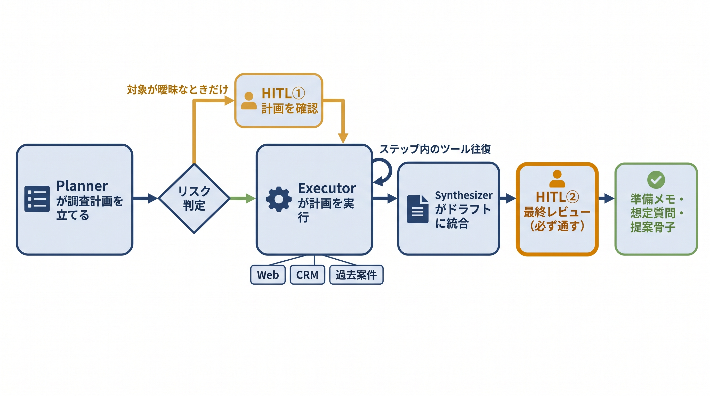

# 第12章 営業商談準備AIエージェント — サンプルコード

本書 第12章の掲載コードを、手元でそのまま動かせる形にまとめたものです。
この章のエージェントは、モデルが調査計画を立て（Planner）、Web・CRM・過去案件の3つの情報源を調べ（Executor）、準備メモ・想定質問・提案骨子のドラフトにまとめる（Synthesizer）Plan-and-Execute 型です。通常の参照調査は自動実行し、対象が曖昧な計画だけ人間の確認（HITL①）を挟み、最終ドラフトは必ず人間のレビュー（HITL②）を通します。サンプルでは、この「止めるべきところだけ止める」二段構えのHITLと、Executor の二重ループ（ステップ内のツール往復＋計画全体の再帰エッジ）を確かめられます。



## 収録ファイル

| ファイル | 対応する本文の節 | 確かめられること | APIキー |
|---------|----------------|----------------|--------|
| `_common.py` | 12-3、12-4、12-6、12-7 | 共通部品（ダミーのWeb・CRM・過去案件データ、計画のリスク判定ルール、計画・統合の擬似モデル）。単体実行はしない | 不要 |
| `12-5_langgraph_features_minimal.py` | 12-3「HITLをどこで発動するか」/ 12-5「Executorが計画を実行する」 | `interrupt`＋`Command(resume=...)`、ToolNode、再帰エッジ＋`recursion_limit` の3機能をそれぞれ独立した最小例で | 不要 |
| `12-4_planner_hitl.py` | 12-3 / 12-4「Plannerが調査計画を立てる」 | 通常計画は自動実行、リスクのある計画だけ `interrupt` で停止し、承認・却下で分岐すること | 不要 |
| `12-5_executor_loop.py` | 12-5 / 12-6「異なる情報源をツールとして使い分ける」 | ToolNode を使うステップ内ループ（小）と計画全体のループ（大）の二重構造 | 不要 |
| `12-2_agent_pipeline.py` | 12-2〜12-7 | Planner → リスク判定 → 必要時HITL① → Executor → Synthesizer → HITL② → 出力の全体版。4経路（自動実行/確認して承認/却下/ドラフト却下）を自動デモ | 不要 |
| `12-2_export_mermaid.py` ＋ `12-2_agent_pipeline.mmd` | 12-2「処理フローとアーキテクチャの全体設計」 | 全体版グラフのノードとエッジを Mermaid 形式で書き出し、本文の図と突き合わせられる | 不要 |
| `12-7_agent_pipeline.py` | 12-7「Synthesizerが調査結果を束ねる」 | 本文 12-7 から参照される実行エントリー。実体は `12-2_agent_pipeline.py`（Synthesizer は同ファイルの 12-7 セクション）で、同じ4経路の自動デモが動く | 不要 |
| `interactive_meeting_prep.py` | （本リポジトリ限定の追加教材。本文には登場しません） | 自分の商談相手・目的で Planner の計画を確かめ、HITL①②の承認・修正・却下を標準入力で体験 | 任意 |

## 前提

- Python 3.10 以上（実行確認は 3.12）
- パッケージ管理は [uv](https://docs.astral.sh/uv/) を推奨します。uv がない場合は標準の `venv` + `pip` でも同じ手順で動きます
- 依存パッケージは `requirements.txt` のとおり（langgraph 1.x / langchain-core）。更新が速い分野のため、版に上限を切って固定しています

## セットアップ

uv を使う場合:

```bash
cd chapters/12_営業商談準備AIエージェント/samples
uv venv
source .venv/bin/activate        # Windows は .venv\Scripts\activate
uv pip install -r requirements.txt
```

uv がない場合（標準の venv + pip）:

```bash
cd chapters/12_営業商談準備AIエージェント/samples
python3 -m venv .venv
source .venv/bin/activate        # Windows は .venv\Scripts\activate
pip install -r requirements.txt
```

> **Windows の文字化け対策**
>
> サンプルは日本語を出力するため、コンソールの文字コードが cp932 だと文字化けすることがあります。`set PYTHONUTF8=1`（PowerShell は `$env:PYTHONUTF8="1"`）を設定するか、`-X utf8` を付けて実行してください。

## APIキーなしで確認する（ドライラン）

書籍に掲載したスクリプトは、**すべてAPIキー・ネットワークなし**で最後まで動きます。ドライランで代役を立てているのは次の3か所です。

- **Planner / Synthesizer**: 本物のLLMの代わりに擬似モデル（`_common.py` の `pseudo_plan` / `pseudo_synthesize`）。計画は3ステップ固定、統合は決め打ちロジックで、「材料に無いことは推測で埋めず未確認とする」方針をコードで再現しています
- **Executor のモデル判断**: 「ツールの結果がまだ無ければツールを1つ呼び、結果を見たらそのステップを終える」決め打ち。本番では `model_with_tools.invoke(...)` がこの判断ごと担います
- **3つの情報源**: Web検索・CRM・過去案件RAG の代わりにダミーデータ。知っている企業は「みらい物流」だけです

また、`12-2_agent_pipeline.py` と `12-4_planner_hitl.py` のデモでは、HITL の `interrupt` を `Command(resume=...)` で**自動再開**して4経路を通します（人間の入力で止めたい場合は後述の `interactive_meeting_prep.py` を使ってください）。

つまりドライランで確認できるのは、HITLの発動条件と再開の型、二重ループの回り方、却下されたドラフトが `finalize` に進まない（外に出ない）構造です。実際のモデルが立てる計画の質や、実サービス（Web検索MCP・CRM・RAG）へのOAuth接続と権限は確認できません。

```bash
python 12-5_langgraph_features_minimal.py   # interrupt / ToolNode / ループの最小例
python 12-4_planner_hitl.py                 # 条件付きHITL①（自動実行・承認・却下）
python 12-5_executor_loop.py                # 二重ループで計画を消化
python 12-2_agent_pipeline.py               # 全体版（4経路の自動デモ）
python 12-7_agent_pipeline.py               # 同上（本文12-7からの参照名。実体は12-2）
python 12-2_export_mermaid.py               # グラフ構造を .mmd へ書き出し
```

期待される出力（要点）:

`12-4_planner_hitl.py` — 通常の計画は止まらず、「同名企業」を含むゴールだけ止まります。

```text
=== 通常の参照調査 ===
  → 確認理由なし。HITLを挟まず自動実行
=== 対象が曖昧な計画を確認して承認 ===
  一時停止理由: ['対象企業を一意に特定できない']
  計画: ['...の直近ニュースをWebで調べる', ...]
  人間の判断: {'approved': True}
    → 確定した計画を実行へ: [...]
```

`12-2_agent_pipeline.py` — 4経路が順に流れます。承認経路では最後に「商談準備ドキュメント（承認済み）」（準備メモ・想定質問・確認したい質問・提案骨子・未確認事項と出典の5項目）が表示され、却下経路では「→ 却下のため出力しない（ドラフトは外に出ていない）」となります。

`12-5_executor_loop.py` — 3ステップの計画が二重ループで消化され、findings に `[web_search]`→`[crm_search]`→`[past_case_search]` の結果が積まれます。

## ANTHROPIC_API_KEY を使って動かす（本番モード）

書籍掲載のスクリプトはドライラン専用で、APIキーを設定しても動作は変わりません。キーで動くのは追加教材 `interactive_meeting_prep.py` の本番モードだけで、**Planner と Synthesizer** が実際の Claude 呼び出しに差し替わります（Executor のステップ実行の判断と3つの情報源はダミーのまま）。

```bash
pip install anthropic                    # uv でセットアップした場合は: uv pip install anthropic
export ANTHROPIC_API_KEY=sk-ant-...      # Windows (cmd) は set ANTHROPIC_API_KEY=...
python interactive_meeting_prep.py
```

> uv の `uv venv` で作った仮想環境には `pip` コマンドが入っていません。uv でセットアップした場合は `pip install ...` の代わりに `uv pip install ...` を使ってください。

実行前に知っておくべきこと:

- **従量課金が発生します。** 1商談あたり Planner と Synthesizer で計2回APIを呼び、計画と調査結果をプロンプトに含めるため、入出力あわせて数千トークン程度を消費します。少額ですが無料ではありません
- **モデル名は将来変わります。** `interactive_meeting_prep.py` 冒頭の定数 `MODEL`（例 `claude-sonnet-4-6`）が廃止された場合は、Anthropic 公式ドキュメントで現行のモデル名を確認して書き換えてください
- **入力した企業名・商談の目的と、ダミー情報源の調査結果が Anthropic の API に送信されます。** 実在の商談情報を入力する場合は、送信してよい内容か確認してください
- **出力は実行ごとに変わりえます。** 計画のステップ構成・件数・クエリ、ドラフトの文面はモデルの判断です。モデルの返答をJSONとして解釈できなかった場合は、その旨を表示して擬似モデルに自動で切り替わります。「Executor が呼べるのは3つの読み取り専用ツールだけ」「ドラフトは承認されるまで外に出ない」という構造はコード側で保証されており、ここが確認の観点です

## 自分で確かめる（interactive_meeting_prep.py）

`interactive_meeting_prep.py` は、12-2 のパイプラインのノードを import し、商談相手・目的の入力と HITL の判断（承認・修正・却下）を標準入力で行う本リポジトリ限定の追加スクリプトです（書籍本文には登場しません）。12-2 の自動デモとの違いは、`Command(resume=...)` に渡す判断を実際にあなたが入力する点です。APIキーなしでも擬似モデルで流れ全体を確認できます。

```bash
# 対話モード。企業名に空行を入力するか Ctrl+C で終了
python interactive_meeting_prep.py
```

試すとよい入力:

- 企業名 `みらい物流`・目的 `新規提案` — ダミー情報源が材料を返す基本形。HITL①は発動せず、Plannerの計画表示 → 調査 → HITL②のドラフト承認/却下へ進みます
- 目的に `同名企業の可能性がある 新規提案` のように「同名企業」を含める — 計画確認（HITL①）が発動します。`y`（承認）/`n`（却下）のほか、`1,3` のように残すステップ番号を入力すると**計画を修正して実行**する経路（`edited_plan`）を通ります
- 実在しない企業名（例 `架空商事`）— 調査が空振りし、ドラフトが「未確認」だらけになります。材料が無いことを推測で埋めない方針（12-7）の確認です
- HITL②で `y` 以外を入力 — ドラフトが `finalize` に進まず、外に出ないことを確認できます

## うまくいかないとき

- **`ModuleNotFoundError: No module named 'langgraph'`**: 仮想環境の有効化（`source .venv/bin/activate`）と `pip install -r requirements.txt` を確認してください
- **`GraphRecursionError`**: ループのステップ数が `recursion_limit`（サンプルは50）を超えています。計画のステップ数を増やす改造をした場合は上限も上げてください（本文12-5）
- **`12-2_export_mermaid.py` の出力が変わらない**: 出力先は同じフォルダの `12-2_agent_pipeline.mmd` です。グラフを改造した後に再実行すると上書きされます
- **日本語が文字化けする（Windows）**: `set PYTHONUTF8=1` を設定するか `-X utf8` を付けて実行してください
- **キーを設定したのに interactive が擬似モデルのまま**: `anthropic` パッケージの導入と、`export ANTHROPIC_API_KEY=...` を実行したシェルと同じシェルで実行しているか（`echo $ANTHROPIC_API_KEY`）を確認してください
- **本番モードで「JSONとして解釈できなかった」と表示される**: 異常ではなくフォールバックです。モデルが指定の形式で返さなかった場合は擬似Planner／擬似Synthesizerに切り替えて続行します
- **`not_found_error` などモデル名に関するAPIエラー**: モデルが廃止された可能性があります。`interactive_meeting_prep.py` の `MODEL` を現行のモデル名に書き換えてください
