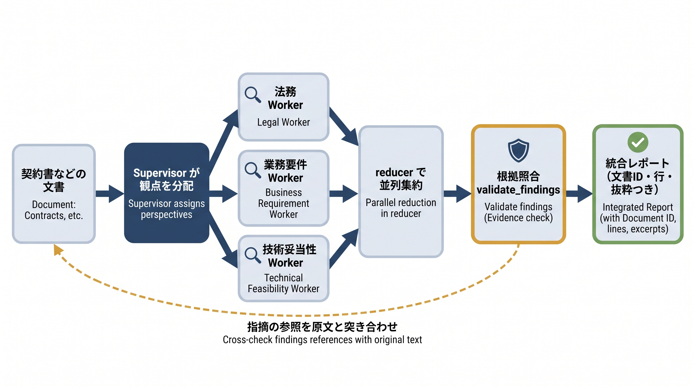

# 第13章 文書レビュー補助AIエージェント — サンプルコード

本書 第13章の掲載コードを、手元でそのまま動かせる形にまとめたものです。
この章のエージェントは、Supervisor が契約書などの文書を法務・業務要件・技術妥当性の3観点へ割り当て、複数の Worker が**並列**に下読みし、文書内参照（文書ID・版・章・行・抜粋）つきの指摘を統合レポートにまとめる Supervisor-Worker 型です。骨格は LangGraph、Worker には Claude Agent SDK も組み合わせるハイブリッド構成が本文の主線です。サンプルでは、fan-out と reducer による並列集約（13-4）、Worker の分析（13-5）、そして統合前に指摘の参照を原文と突き合わせる根拠照合（13-6）を確かめられます。



## 収録ファイル

| ファイル | 対応する本文の節 | 確かめられること | APIキー |
| --------- | ---------------- | ---------------- | -------- |
| `_common.py` | 13-5「Workerが観点別に分析する」/ 13-6「結果を統合し根拠を照合する」 | 共通部品（ダミー業務委託契約書、キーワード規則の擬似Worker、根拠照合 `validate_findings`、擬似統合）。単体実行はしない | 不要 |
| `13-4_parallel_minimal.py` | 13-4「Supervisorが観点を分配する」 | fan-out（複数行き先エッジ）、reducer（`operator.add`）での fan-in、`Send` API による動的並列の最小例 | 不要 |
| `13-4_supervisor.py` | 13-4 | Supervisor が3観点の Worker へ並列に振り分け、結果が reducer で集約されること | 不要 |
| `13-5_worker.py` | 13-5 | (A) Claude Agent SDK `query()` を使う本番 Worker の骨格と、(B) オフラインで動く擬似 Worker。既定は (B) だけを実行 | (A)のみ必要 |
| `13-2_agent_pipeline.py` | 13-2〜13-6 | Supervisor → 3Worker 並列 → 集約 → 根拠照合 → 統合レポートの全体版。実在しない第99条を指す指摘1件が「根拠不一致」に分けられること | 不要 |
| `interactive_doc_review.py` | （本リポジトリ限定の追加教材。本文には登場しません） | 自分のテキスト（ファイル指定 or 貼り付け）を3観点で並列レビューさせ、根拠照合の効き方を観察 | 任意 |

## 前提

- Python 3.10 以上（実行確認は 3.12）
- パッケージ管理は [uv](https://docs.astral.sh/uv/) を推奨します。uv がない場合は標準の `venv` + `pip` でも同じ手順で動きます
- 依存パッケージは `requirements.txt` のとおり（langgraph 1.x / langchain-core）。Claude Agent SDK（`claude-agent-sdk`）は 13-5 の本番経路を試すときだけ必要で、ドライランには不要です

## セットアップ

uv を使う場合:

```bash
cd chapters/13_文書レビュー補助AIエージェント/samples
uv venv
source .venv/bin/activate        # Windows は .venv\Scripts\activate
uv pip install -r requirements.txt
```

uv がない場合（標準の venv + pip）:

```bash
cd chapters/13_文書レビュー補助AIエージェント/samples
python3 -m venv .venv
source .venv/bin/activate        # Windows は .venv\Scripts\activate
pip install -r requirements.txt
```

> **Windows の文字化け対策**
>
> サンプルは日本語を出力するため、コンソールの文字コードが cp932 だと文字化けすることがあります。`set PYTHONUTF8=1`（PowerShell は `$env:PYTHONUTF8="1"`）を設定するか、`-X utf8` を付けて実行してください。

## APIキーなしで確認する（ドライラン）

書籍に掲載したスクリプトは、既定では**すべてAPIキー・ネットワークなし**で最後まで動きます。ドライランで代役を立てているのは次の2か所です。

- **Worker（3観点の分析）**: 本番の Claude Agent SDK `query()` の代わりに、観点ごとのキーワード規則で文書を走査する擬似 Worker（`_common.py`）。指摘の中身は決め打ちです
- **Supervisor の統合**: 実際のモデル呼び出しの代わりに、指摘を観点別に整形する擬似統合

一方、**並列 fan-out・reducer での集約・根拠照合（`validate_findings`）は本物のロジック**です。指摘の文書ID・版・章・行が原文と一致し、抜粋が該当行に含まれるものだけを採用する検証は、ドライランでもそのまま動きます。確認できないのは、実モデルの指摘の質と、Claude Agent SDK の実際の挙動（後述の本番経路で確認）です。

```bash
python 13-4_parallel_minimal.py   # fan-out / reducer / Send の最小例
python 13-4_supervisor.py         # 3観点への並列振り分け
python 13-5_worker.py             # 擬似Worker単体（法務観点）
python 13-2_agent_pipeline.py     # 全体版（並列レビュー→根拠照合→統合レポート）
```

期待される出力（要点）:

`13-2_agent_pipeline.py` — デモとして、実在しない第99条を指す「でっち上げの指摘」を最初から1件混ぜてあります。3観点の6件は根拠を確認できた指摘として観点別に、1件は根拠不一致として分けて表示されます。

```text
=== 3観点を並列レビューして統合 ===
  集まった指摘の総数: 7件（3観点ぶん＋デモ用のでっち上げ1件）
  根拠不一致の指摘: 1件 → ['第99条(存在しない)']
  根拠を確認できた指摘: 6件

# 文書レビュー統合レポート
## 法務の観点（2件）
- [高] 損害賠償の上限額（キャップ）の定めがなく、…（根拠: 第5条(損害賠償) 行7「…」）
…
## 根拠不一致・未確認（1件）
- [法務] でっち上げの指摘（検証デモ用） （申告された参照: 第99条(存在しない) 行99）
```

モデルの申告を信用せず、統合前にコードで原文と突き合わせる——という 13-6 の主張を、この分離で確かめられます。

## ANTHROPIC_API_KEY を使って動かす（本番モード）

APIキーで動かせる経路は2つあります。どちらも任意です。

### (a) 13-5_worker.py の Claude Agent SDK 経路

環境変数 `USE_CLAUDE_AGENT_SDK` を設定すると、擬似 Worker の代わりに Claude Agent SDK の `query()` で法務観点の分析を実行します。

```bash
pip install claude-agent-sdk             # uv でセットアップした場合は: uv pip install claude-agent-sdk
export ANTHROPIC_API_KEY=sk-ant-...
USE_CLAUDE_AGENT_SDK=1 python 13-5_worker.py
```

> uv の `uv venv` で作った仮想環境には `pip` コマンドが入っていません。uv でセットアップした場合は `pip install ...` の代わりに `uv pip install ...` を使ってください（以降の `pip install` も同様）。

- モデル名はスクリプトでは指定しておらず、SDK の既定モデルが使われます。特定のモデルを使いたい場合や既定モデルの廃止時は、`13-5_worker.py` の `ClaudeAgentOptions` に `model="..."` を追加してください
- `max_turns=8` までエージェントが自走するため、トークン消費は単発のAPI呼び出しより大きめです
- `allowed_tools` はツールの利用可能範囲を限定する設定ではありません。サンプルは利用させない組み込みツールを `disallowed_tools`（Write / Edit / Bash / NotebookEdit）で遮断しています。本番では実行環境の資格情報・ネットワーク・ファイル権限も読み取り専用にしてください（本文13-5）

### (b) interactive_doc_review.py の本番モード

追加教材のレビュースクリプト（次節）は、キーと `anthropic` パッケージがあれば3観点の Worker を実際の Claude 呼び出し（Messages API）に差し替えます。

```bash
pip install anthropic
export ANTHROPIC_API_KEY=sk-ant-...      # Windows (cmd) は set ANTHROPIC_API_KEY=... Windows（powershell）は $env:ANTHROPIC_API_KEY="..."
python interactive_doc_review.py --file レビューしたい文書.txt
```

実行前に知っておくべきこと（両経路共通）:

- **従量課金が発生します。** (b) は1文書につき3観点×1回＝3回APIを呼び、毎回**文書全文**をプロンプトに含めます。長い文書ほどトークン消費が大きくなります
- **モデル名は将来変わります。** (b) は `interactive_doc_review.py` 冒頭の定数 `MODEL`（例 `claude-sonnet-4-6`）を使います。廃止時は Anthropic 公式ドキュメントで現行のモデル名を確認して書き換えてください
- **レビュー対象の文書全文が Anthropic の API に送信されます。** 実在の契約書や社外秘文書を貼り付ける前に、送信してよい内容か必ず確認してください
- **出力は実行ごとに変わりえます。** 指摘の件数・内容・重大度はモデルの判断です。モデルが申告した参照（章・行・抜粋）が原文と一致しない指摘は「根拠不一致・未確認」に分類されます——これは不具合ではなく、13-6 の根拠照合が効いている状態です

## 自分で確かめる（interactive_doc_review.py）

`interactive_doc_review.py` は、自分のテキストを 13-2 と同じパイプライン（並列 fan-out → 集約 → 根拠照合 → 統合）に通す本リポジトリ限定の追加スクリプトです（書籍本文には登場しません）。テキストは行ごとに番号を振り、「第N条」で始まる行を章の切れ目として拾って、13章の文書形式に変換します。

```bash
# ファイルを1回レビュー
python interactive_doc_review.py --file 契約書.txt

# 貼り付けモード。文書を貼って空行で確定。何も貼らずに空行（または Ctrl+C）で終了
python interactive_doc_review.py
```

APIキーなしのときは擬似 Worker（キーワード規則）で動きます。規則が反応する語は「賠償」「催告なく」「別途協議」「問題がなければ検収」「個人情報」「納入する」の6つで、これらを含まないテキストでは指摘0件になります（異常ではありません）。`_common.py` のダミー契約書の文面を少し変えたテキストを貼ると、規則の反応と根拠照合の通過を確かめられます。

APIキーありのときは自由なテキストに対する指摘が得られます。試すとよい観察:

- 賠償上限や検収基準をわざと曖昧に書いた契約書風のテキストを貼る — 3観点がそれぞれ何を拾うか
- 統合レポートの「根拠不一致・未確認」に落ちた指摘があれば、その `excerpt` を原文と見比べる — モデルの写し間違いを照合が弾いた実例
- 同じ文書を2回レビューする — 指摘の件数・内容が実行ごとに揺れること（13-7 で評価データセットが必要になる理由の体感）

## うまくいかないとき

- **`ModuleNotFoundError: No module named 'langgraph'`**: 仮想環境の有効化（`source .venv/bin/activate`）と `pip install -r requirements.txt` を確認してください
- **貼り付けモードで文書が途中までしかレビューされない**: 貼り付けは空行で確定するため、空行を含む文書は途中で切れます。`--file` で渡してください
- **擬似 Worker で指摘が0件になる**: 異常ではありません。キーワード規則（上記6語）に反応しなかっただけです。本番モードなら自由な文書にも指摘が付きます
- **`USE_CLAUDE_AGENT_SDK=1` で `ModuleNotFoundError: No module named 'claude_agent_sdk'`**: `pip install claude-agent-sdk` を実行してください（`requirements.txt` には含めていません）
- **キーを設定したのに interactive が擬似 Worker のまま**: `anthropic` パッケージの導入と、`export ANTHROPIC_API_KEY=...` を実行したシェルと同じシェルで実行しているか（`echo $ANTHROPIC_API_KEY`）を確認してください
- **「Worker失敗」「レビュー未完了」と表示される**: APIエラー、未完了の応答、不正なJSONや指摘形式は「指摘なし」とは区別されます。失敗した観点・例外の種類・再実行要否を未確認事項に残し、成功した観点の結果を保持します。接続設定と応答形式を確認し、必要なら文書を短くして再実行してください。正常に完了して `[]` が返った場合だけ、その観点を指摘0件として扱います
- **`not_found_error` などモデル名に関するAPIエラー**: モデルが廃止された可能性があります。`interactive_doc_review.py` の `MODEL`（または 13-5 の `ClaudeAgentOptions`）を現行のモデル名に合わせてください
- **日本語が文字化けする（Windows）**: `set PYTHONUTF8=1` を設定するか `-X utf8` を付けて実行してください

## 回帰テスト（APIキー不要）

```bash
python -m unittest discover -p "test_*.py" -v
```

空行を含むファイルでも、参照には元ファイルの行番号を使います。
